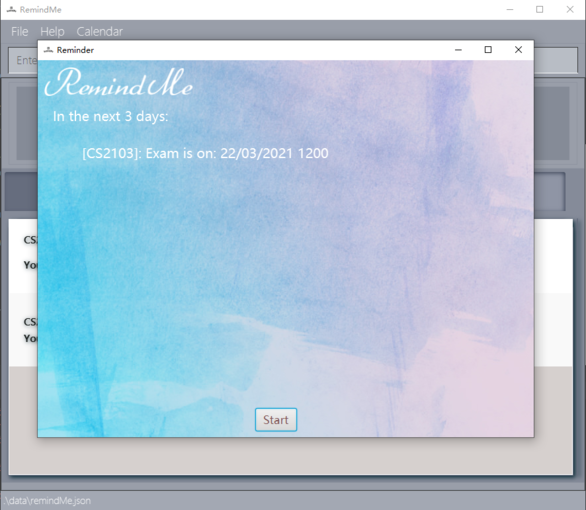

### RemindMe
RemindMe is a desktop app designed to help School of Computing students better manage their workload
and take control of their work life. 
For the detailed documentation of this project, check out our **[product website](https://nus-cs2103-ay2021s2.github.io/tp/)**.

### Value Proposition
* Adding of modules, and assignments and exams that belong to each module.
* Adding of general events to keep track of non-school related tasks.
* Adding of friends to keep track of their birthdays.
* Provides calendar view to help users visualise your schedule.
* Ability to plan your schedules with ease.
* Reminder pop-up box to remind you of upcoming deadlines and tasks within the next 3 days.

### Acknowledgement
* This project is based on the AddressBook-Level3 project created by the [SE-EDU initiative](https://se-education.org).
* Libraries used: [JavaFX](https://openjfx.io/), [Jackson](https://github.com/FasterXML/jackson), [JUnit5](https://github.com/junit-team/junit5).
