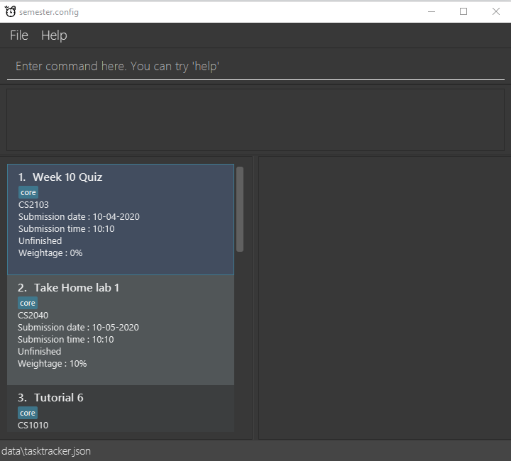

* ## **Instructions**
  1. Ensure that you have Java 11 or above installed in your computer
  2. Download the latest [semester.config] from [https://github.com/AY2021S2-CS2103-T14-4/tp/releases]
  3. Copy the file download location to the folder that you want to use as the home folder for your [semester.config]
  4. Double-click on the file to start the app
  5. Once the app is started, you can begin by typing certain commands in the command box to execute certain actions. E.g: typing help and pressing enter will open the help windows for guidance on some command executions.
      * add a task : `add n/Finals mc/CS2103 d/15-11-2020 t/18:00 w/10% pt/core ptag/HIGH` will add this module to the list (pt/ and ptag/ are optional, ptag/ will be set to LOW by default).
      * delete a task : `delete 3` will delete 3rd task from the list.
      * see all tasks : `list` will show all module tasks.
      * mark as done : `done 3` will mark the 3rd task from the list as done.
      * sort : `sort dateTime` will sort based on deadline date and time (chronological order) and show all the tasks in list.
      * sort : `sort taskName` will sort based on task name (lexicographical order) and show all the tasks in list.
      * sort : `sort moduleCode` will sort based on module code (lexicographical order) and show all the tasks in list.
      * sort : `sort priorityTag LOW/MEDIUM/HIGH` will sort based on priority levels (from HIGH to LOW) and show all tasks in list.
      * sort : `sort weightage` will sort weightage in descending order and show all the tasks in list.
      * edit task : `edit 3 n/PE` will allow user to edit the 3rd task and change the task name to be "PE".
      * edit task : `edit 3 mc/CS2100` will allow user to edit the 3rd task and change the module code to "CS2100".
      * edit task : `edit 3 d/10-06-2021` will allow user to edit the 3rd task and change the deadline to "10-06-2021".
      * edit task : `edit 3 t/23:59` will allow user to edit the 3rd task and change the time to "23:59".
      * edit task : `edit 3 w/25%` will allow user to edit the 3rd task and change the weightage to "25%".
      * edit task : `edit 3 pt/non-core` will allow user to edit the 3rd task and change the tag to "non-core".
      * edit task : `edit 3 ptag/MEDIUM` will allow user to edit the 3rd task and change the priority tag to "MEDIUM".
      * edit task : `edit 3 notes/Programming is hard :(` will allow user to edit the 3rd task and change the notes to "Programming is hard :(".
      * add notes : `notes 3 notes/Hello World!` will add the note "Hello World!" to the 3rd task from the list.
      * Time-based alert : `dueIn` will show a list of immediate tasks that will be due by next week.
      * clear : `clear` will delete all module tasks on the list.
  6. Refer to the features for each individual commands for more details

## **Commands**

1. ### Delete Task : *delete*
  * Deletes the task at the specified index.

  * Format:  `delete INDEX`

    1. Index to be inserted must be positive, and

    2. Index must be available on the list, else an error will be thrown.

    - Example: Using the command `list` to show all tasks, the user wants to delete the 2nd task. User uses command `delete 2` to delete the 2nd task from the list.

    - Example: `delete 3` will delete the 3rd task on the list.

2. ### Edit Task: *edit*

  * Edits the task at the specified index.

  * Format: `edit INDEX [n/TASK NAME] [mc/MODULE CODE] [d/DEADLINE DATE] [t/DEADLINE TIME] [notes/NOTES] [pt/TAG] [ptag/PRIORITY TAG]`

    1. The index must be a positive integer.

    2. The index must be on the list else an error will be thrown.

    3. At least one of the optional fields must be provided.

    4. Existing values will be updated to the input values.

    - Example: `edit 1 n/Software Engineering Finals mc/CS2103`. Edits the name of the task and module code of the task at index 1 to be “Software Engineering Finals” and “CS2103” respectively.

    - Example: `edit 2 pt/Finals pt/Open Book`. Edits the tags of the task at index 2 to be “Finals” and “Open Book” respectively.

    - Example: `edit 3 ptag/HIGH`. Edits the priority tag of the task at index 3 to be "HIGH".

3. ### Clear Application: *clear*

  * Clears all tasks from the application.
  * Format: `clear`

4. ### Locating tasks by task name: *find*

  * Find tasks whose taskName contains any of the given key words.

  * Format: `find KEYWORD[MORE_KEYWORDS]`
    1. The search is case-insensitive. e.g. Assignment will match assignment.
    2. The order of the keywords does not matter. e.g. programming modular will match modular programming.
    3. Only the task taskName is searched.
    4. Only full words will be matched e.g. Java will not match Javascript
    5. Tasks matching at least one keyword will be returned (i.e. OR search). e.g. SQL Python will return SQL Quiz, Python Assignment

      * Example: `find C++` will return C++ project and C++ graded quiz
      * Example: `find assignment exam` will return Final Assignment, Midterm exam

5. ### Sort tasks: *sort*

  * Sort tasks according to the specified parameter.
  * Format: `sort dateTime OR moduleCode OR priorityTag or weightage OR taskName`
    1. Task can be sorted according to these five parameters: date & time (dateTime), module code (moduleCode) or priority tag (priorityTag) or weightage (weightage) or task name (taskName)
    2. For date & time, the tasks will be sorted in chronological order, with the earliest deadline placed first.
    3. For module code, the tasks will be sorted according to the lexicographical ordering of the module codes.
    4. For priority tag, the tasks will be sorted according to this order: HIGH > MEDIUM > LOW. Tasks with higher priority will then be shown at the top of the list.
    5. For weightage, the tasks will be sorted in a descending order, starting from the heaviest weightage.
    6. For task name, the tasks will be sorted according to the lexicographical order of the task names.

6. ### Add notes to tasks: *notes*

  * Adds any additional notes or remarks to an existing task.
  * Format: `notes INDEX notes/NOTES`
    1. Adds user input NOTES to the task at the specified INDEX.
    2. The index refers to the index number shown in the displayed task list.
    3. The index must be a positive integer 1, 2, 3, …
    4. Adding notes to a task that already has existing notes will overwrite the previous notes.

      * Example: `list` followed by `notes 2 notes/Hello World!` adds the note “Hello World!” to the 2nd task in the task list.
      * Example: `find assignment` followed by `notes 1 notes/fooBar` adds the note “fooBar” to the 1st task in the results of the find command.

7. ### List tasks which need to be submitted soon: *dueIn*

  * List all tasks that are due within the days or weeks specified.

  * Format: `dueIn [day/NUMBER_OF_DAYS OR week/NUMBER_OF_WEEKS]`
    1. If no parameters given, tasks shown will be deadlines that will be due by next week.
    2. `NUMBER_OF_DAYS` & `NUMBER_OF_WEEKS` must be a positive integer.
    3. If both `day/` & `week/` are given, an error will be thrown.
    4. Tasks shown are tasks with deadlines starting from today's date.
    5. The limit for dueIn is until 31-12-2099.

      * Example: `dueIn day/2` will show tasks that have deadlines within the next 2 days.

8. ### Toggle the status of a Task: *done*

  * Toggles the status of a task.
  * Format: `done INDEX`
    1. Index to be inserted must be positive, and

    2. Index must be available on the list, else an error will be thrown.

      * Example: Task 3 has finished. `done 3` will mark task 3 to be unfinished. If the user types `done 3` again, it will mark task 3 to be finished again.

9. ### Undo the previous command: *undo*

  * Undoes the previous command.
  * Format: `undo`
    1. Only commands which modify the state of the TaskTracker will be undone
    2. There must be previous states to undo to

10. ### Redo the previously undone command: *redo*

  * Redoes the previously undone command.
  * Format: `redo`
    1. Only commands which modify the state of the TaskTracker will be redone
    2. There must be an available state to redo to

11. ### Add a task to the daily task list: `doToday`

- Adds the specified task from the regular task list to the daily task list.

- Format: `doToday [-a OR -r] INDEX`

  1. Flag to add or remove must be specified: `-a` to add a daily task, `-r` to remove a daily task.

  2. For add flag `-a`: Index must be available on the task list else an error will be thrown.

  3. For remove flag `-r`: Index must be available on the daily task list else an error will be thrown.

## Acknowledgements
1. This project is based on the AddressBook-Level3 project created by the [SE-EDU initiative](https://se-education.org)
