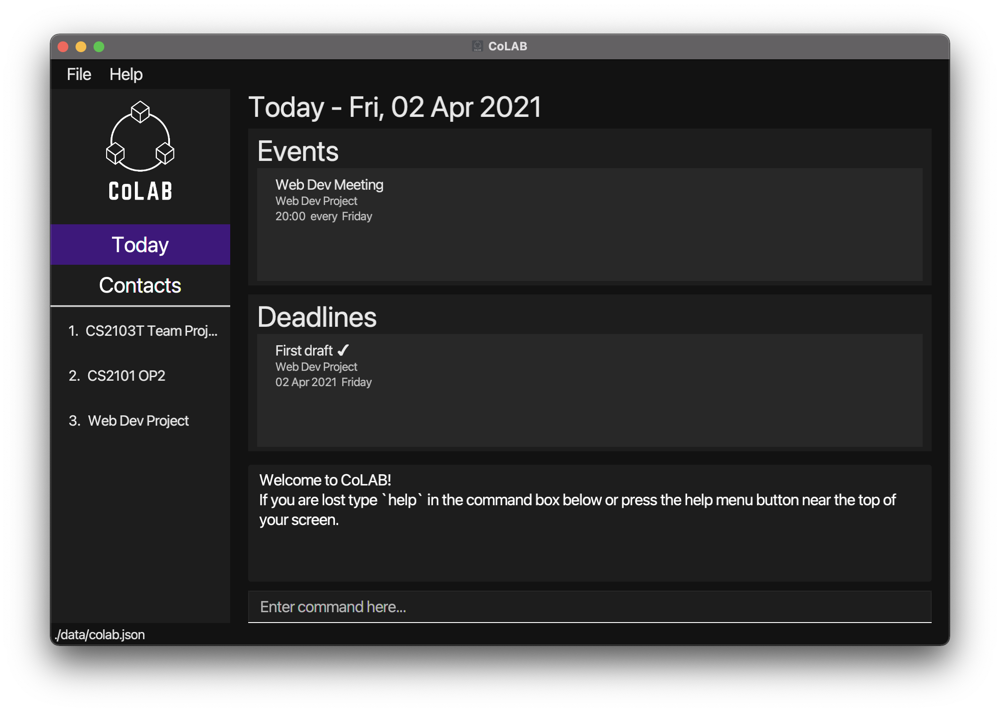

* DietLAH! is **a diet tracking app that is meant to allow users to easily track and maintain their meals so that they are able to maintain their ideal weight and body shape**. 
* While the app has a GUI, inputs and feedback are primarily given via a command-line interface. This allows users to work on the app quickly and efficiently as they get used to the inputs.
* The app currently consists of three main components:
  * BMI Tracker
  * Diet Plan Selector
  * Macronutrients Tracker (for meals)
* The software is written in JDK 11.
* For the detailed documentation of this project, see the **[DietLAH! Product Website](https://ay2021s2-cs2103t-t12-2.github.io/tp/)**.
* This project is based on the AddressBook-Level3 project created by the [SE-EDU initiative](https://se-education.org).
