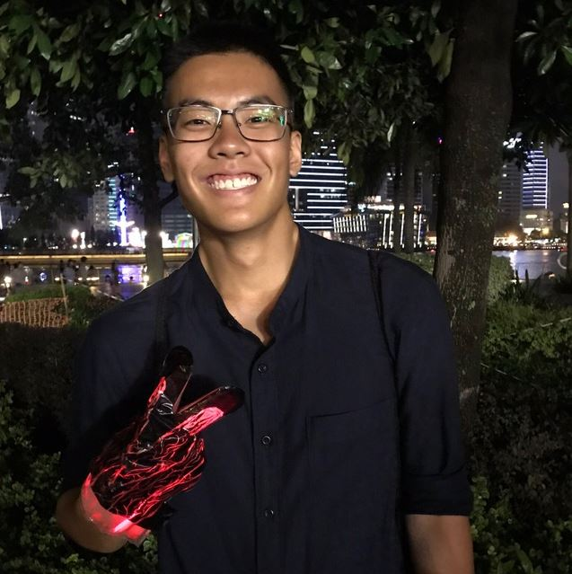
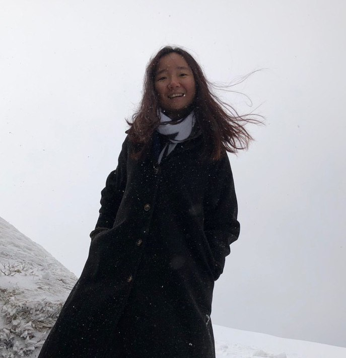
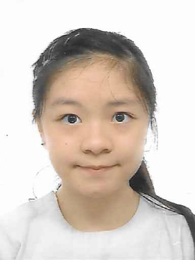
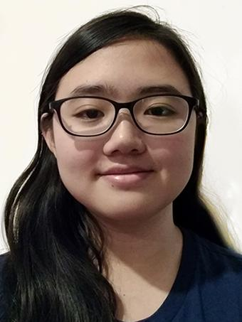

We are a team based in the [School of Computing, National University of Singapore](http://www.comp.nus.edu.sg).

## Project team
### Kuek Yan Ling

[[github](https://github.com/yanlingkuek)]
[[portfolio](team/yanlingkuek.md)]

- Role: Developer
- Responsibilities: Deliverables and Deadlines

### Phoe Chuan Yi, Benny

[[github](http://github.com/Bennyphoe)]
[[portfolio](team/bennyphoe.md)]

- Role: Developer
- Responsibilities: Documentation, Scheduling & Tracking

### Guo Jingxue

[[github](http://github.com/jingxueguo)]

[[portfolio](team/jingxue.md)]

- Role: Developer
- Responsibilities: Code Quality

### Chanell Ng

[[github](http://github.com/chanellNg)]
[[portfolio](team/chanellng.md)]

- Role: Team Lead, Git expert
- Responsibilities: UI

### Carissa Ying

[[github](https://github.com/car155)]
[[portfolio](team/car155.md)]

* Role: Developer
* Responsibilities: Integration, Testing

