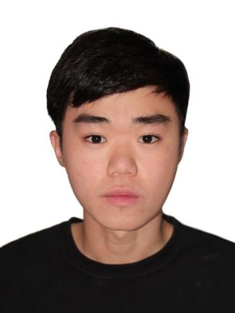
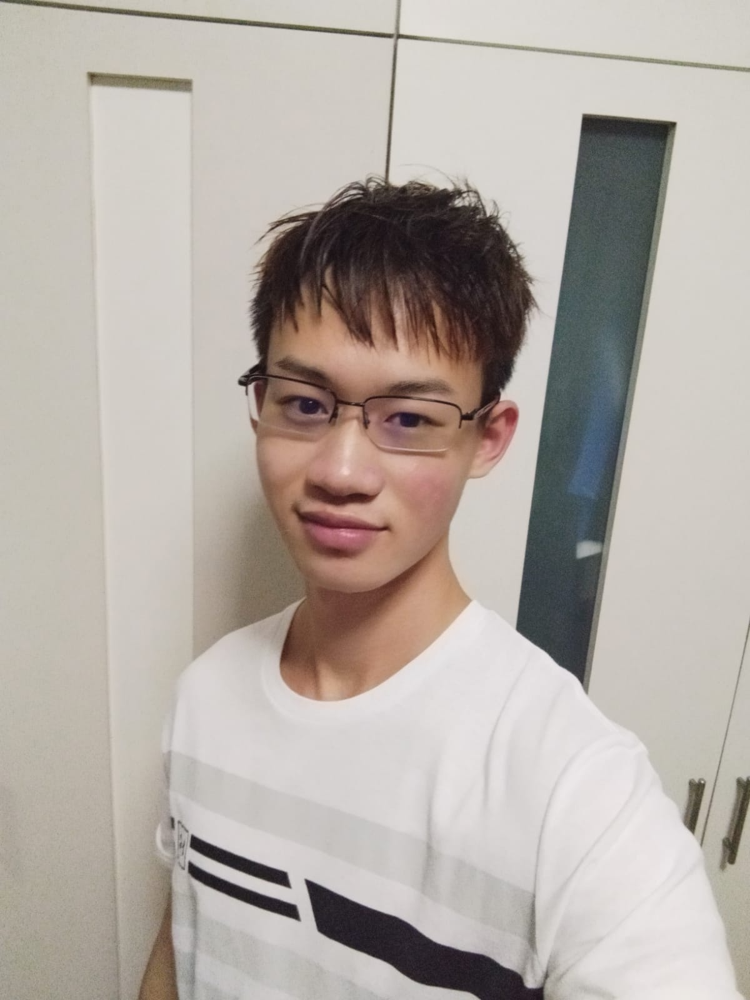
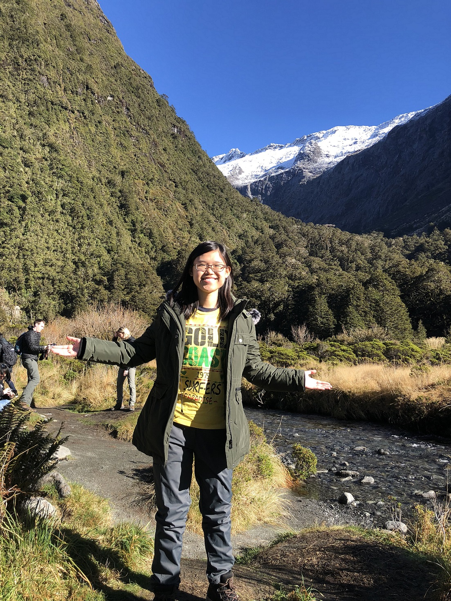

We are a team based in the [School of Computing, National University of Singapore](http://www.comp.nus.edu.sg).

You can reach us at the email `seer[at]comp.nus.edu.sg`

## Team Members

### Lee Rong Jieh

[[github](https://github.com/lrj689)]

### Loh Jun Yong Kevin

[[github](https://github.com/kevinlohjunyong)]

### Nicholas Tanvis

[[github](http://github.com/nicholastanvis)]

### Shen Yang

[[github](http://github.com/goatygoatygoat)]

### Toh Sihui

[[github](http://github.com/tsh22)]

## Responsibilities

Member | Responsibility 1 | Responsibility 2
-- | -- | --
Rong Jieh | Deliverables | Task IC
Kevin Loh | Documentation | Schedule IC
Nicholas | Testing | Contact IC
Shen Yang | Code Quality | Scheduling
Toh Sihui | Tool Expert | Integration
