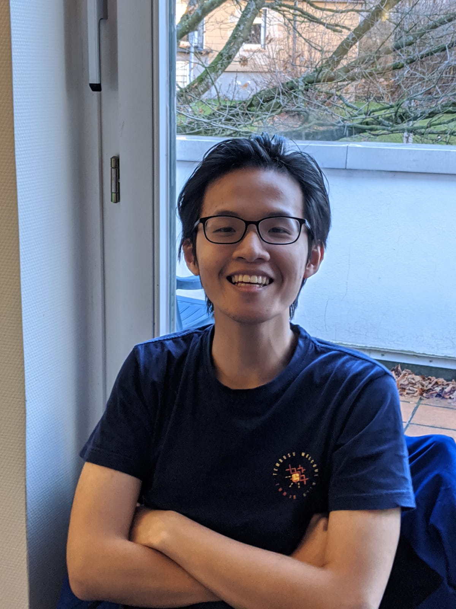
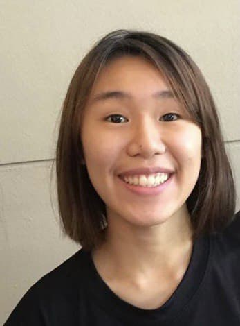
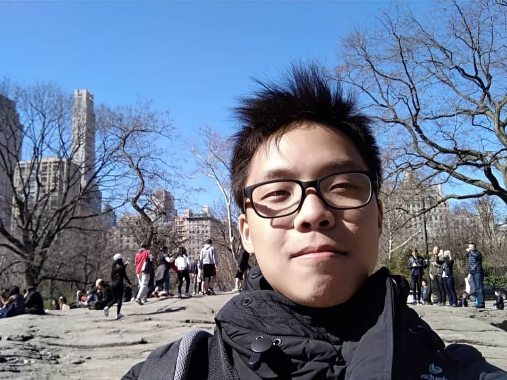
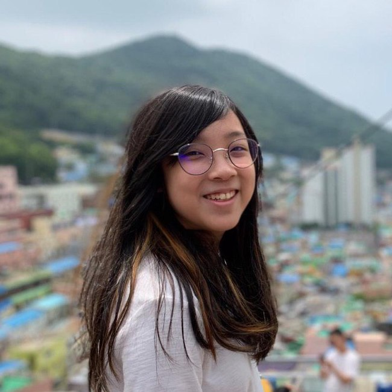

We are a team of Year 2 Computer Science students based in the [School of Computing, National University of Singapore](http://www.comp.nus.edu.sg).

Our team members are:
* [Dan Tran](#dan-tran)
* [Lim Si Ting](#lim-si-ting)
* [Keith Low Jun](#keith-low-jun)
* [Yoong Yi En](#yoong-yi-en)

You can reach us at the email `e0406245@u.nus.edu`

## Project team

### Dan Tran

[[github](https://github.com/picasdan9)]
[[portfolio](team/picasdan9.md)]

* Role: Developer
* Responsibilities: In charge of appointments and UI

### Lim Si Ting

[[github](https://github.com/SiTingST)]
[[portfolio](team/sitingst.md)]

* Role: Developer
* Responsibilities: In charge of storage and user guide  

### Keith Low Jun

[[github](http://github.com/fairyinabottle4)] [[portfolio](team/fairyinabottle4.md)]

* Role: Developer
* Responsibilities: In charge of students and model 

### Yoong Yi En

[[github](http://github.com/yienyoong)]
[[portfolio](team/yienyoong.md)]

* Role: Developer
* Responsibilities: In charge of logic and developer guide 

