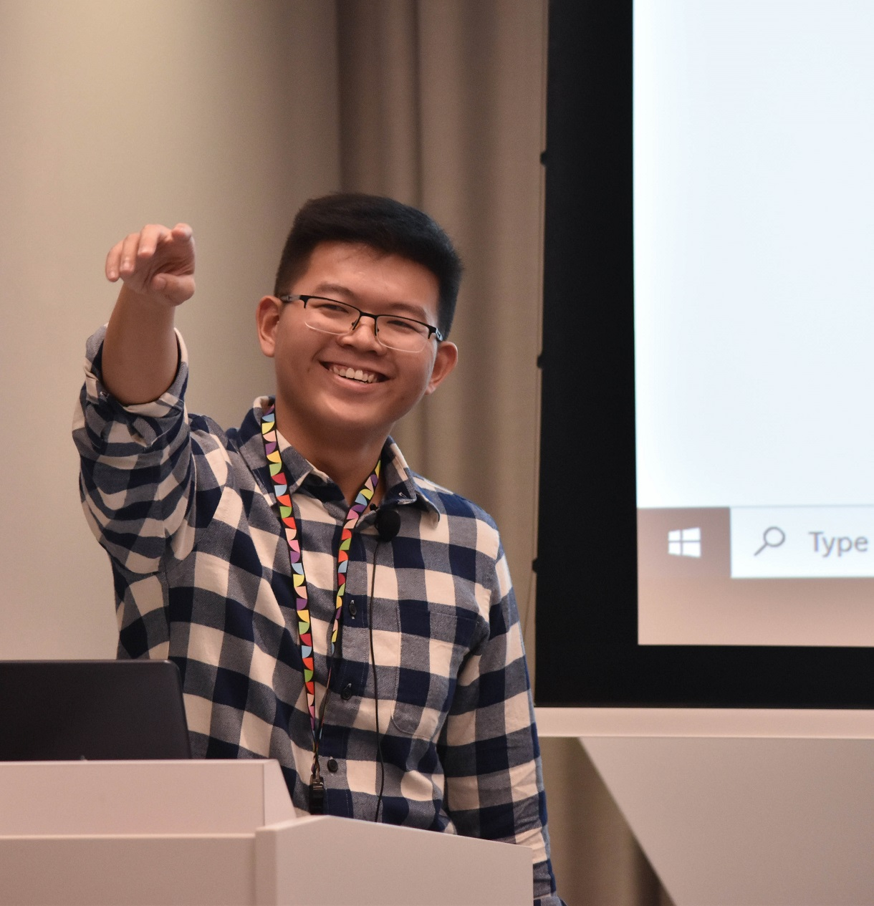
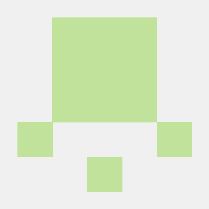
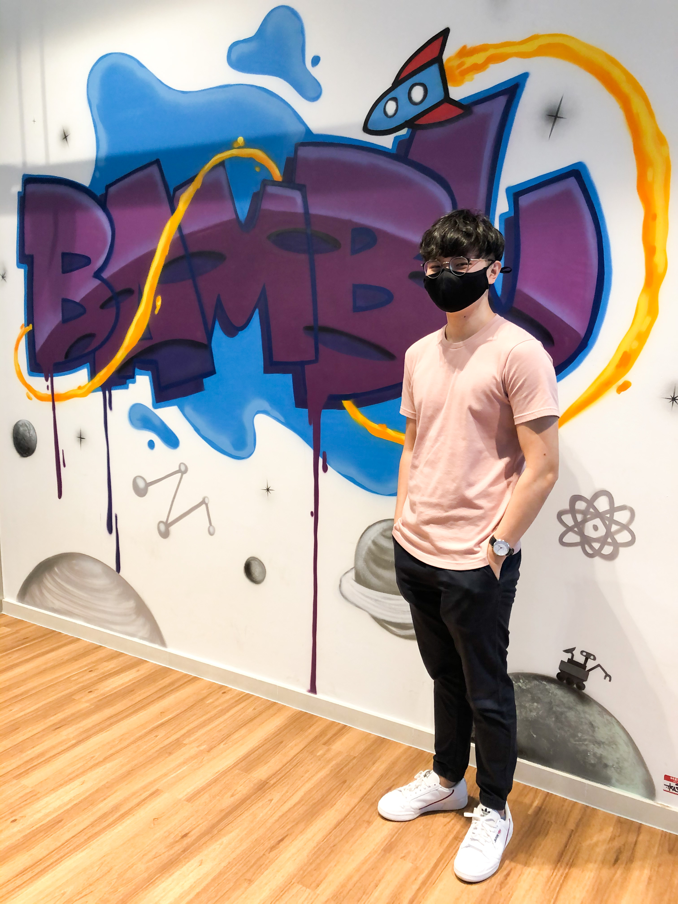

We are a team based in the [School of Computing, National University of Singapore](http://www.comp.nus.edu.sg).

You can reach us at the email `seer[at]comp.nus.edu.sg`

## Project team

### Low En Hao

[[github](https://github.com/enhao25)]
[[portfolio](team/enhao25.md)]

* Role: Deliverables and deadlines / Scheduling and tracking
* Responsibilities: Ensuring that the project is on track.

### Jane Doe

[[github](http://github.com/johndoe)]
[[portfolio](team/johndoe.md)]

* Role: Team Lead
* Responsibilities: UI

### Sunaga Shion

[[github](http://github.com/nowknowing)] [[portfolio](team/nowknowing.md)]

* Role: Testing
* Responsibilities: Ensures the testing of the project is done properly and on time.

### Samuel Lee

[[github](http://github.com/samleewy)]
[[portfolio](team/samleewy.md)]

* Role: Code Quality
* Responsibilities: Ensuring that coding standards are enforced in accordance with checkstyles.

### Goh Jun Wei

[[github](http://github.com/jonahhgohh)]
[[portfolio](team/jonahhgohh.md)]

* Role: Code Quality
* Responsibilities: Ensure that coding standards are enforced.
