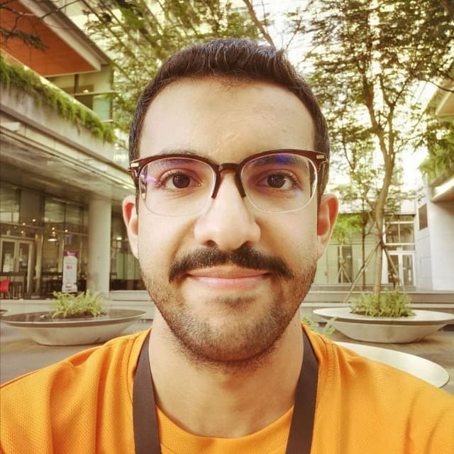

We are a team based in the [School of Computing, National University of Singapore](http://www.comp.nus.edu.sg).

You can reach us at the email `seer[at]comp.nus.edu.sg`

## Project team

### Alzahrani Riyadh Hamdan S

[[github](https://github.com/riyadh-h)]
[[portfolio](team/riyadh-h.md)]

* Role: Member
* Responsibilities: Full Stack Developer

### Dick Jessen William

[[github](http://github.com/jessen11)]
[[portfolio](team/johndoe.md)]

* Role: Developer
* Responsibilities: Full Stack Developer

### Otto Alexander Sutianto

[[github](http://github.com/godjuansan)] [[portfolio](team/johndoe.md)]

* Role: Member
* Responsibilities: Full-Stack Developer

### Jean Doe

[[github](http://github.com/johndoe)]
[[portfolio](team/johndoe.md)]

* Role: Developer
* Responsibilities: Dev Ops + Threading

### James Doe

[[github](http://github.com/johndoe)]
[[portfolio](team/johndoe.md)]

* Role: Developer
* Responsibilities: UI
