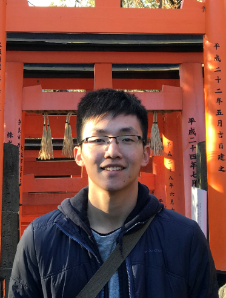

We are a team based in the [School of Computing, National University of Singapore](http://www.comp.nus.edu.sg).

You can reach us at the email `seer[at]comp.nus.edu.sg`

## Project team

### John Doe

[[homepage](http://www.comp.nus.edu.sg/~damithch)]
[[github](https://github.com/johndoe)]
[[portfolio](team/johndoe.md)]

* Role: Project Advisor

### Soh Xin Wei

[[github](http://github.com/xiinweii98)]
[[portfolio](team/xinwei.md)]

* Role: Developer, Testing
* Responsibilities: Logic

### Lim Rui Xiong

[[github](http://github.com/RuiXiong2211)] [[portfolio](team/RuiXiong2211)]
[[portfolio](team/ruixiong.md)]

* Role: Developer, Documentation
* Responsibilities: Commons

### Pavitra

[[github](http://github.com/pavz02)]
[[portfolio](team/pavz02.md)]

* Role: Developer
* Responsibilities: Code quality

### Bhadani Simran

[[github](http://github.com/simran-bhadani3)]
[[portfolio](team/simran-bhadani3)]

* Role: Developer
* Responsibilities: Integration
