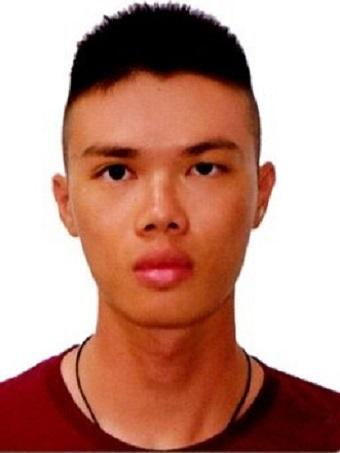
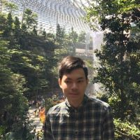
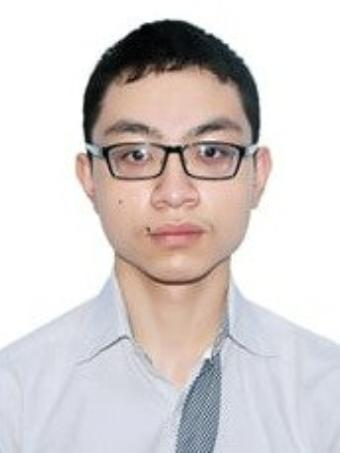
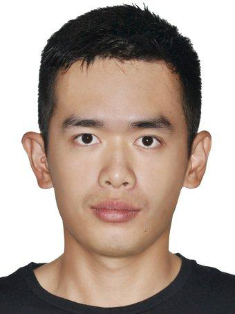

We are a team based in the [School of Computing, National University of Singapore](http://www.comp.nus.edu.sg).

## Project team

### Loo Yeou Tzer

[[github](https://github.com/yeoutzer)]
[[portfolio](team/yeoutzer.md)]

* Role: Developer

### Nguyen Son Linh

[[github](http://github.com/linhns)]
[[portfolio](team/linhns.md)]

* Role: Git + CI + Developer
* Responsibilities: Manage team repository

### Vu Minh Hieu

[[github](https://github.com/vuminhhieunus2019)] [[portfolio](team/vuminhhieunus2019.md)]

* Role: Developer
* Responsibilities: UI

### Lim Zi Qiang, Marcus

[[github](https://github.com/marc-97)]
[[portfolio](team/marc-97.md)]

* Role: Developer

### Zen Lee

[[github](https://github.com/zenlyj)]
[[portfolio](team/zenlyj.md)]

* Role: Developer

