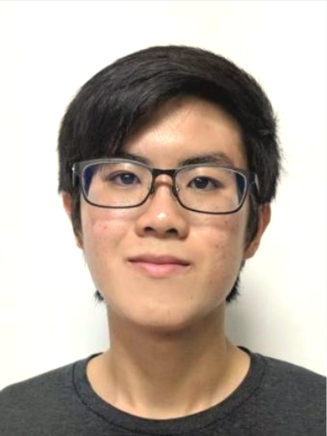
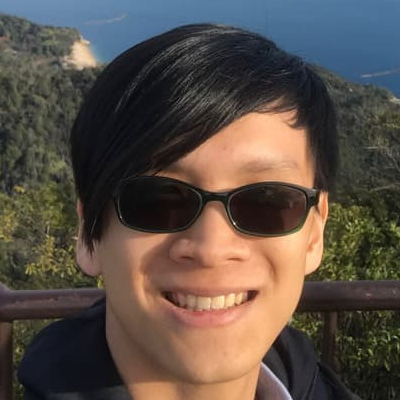
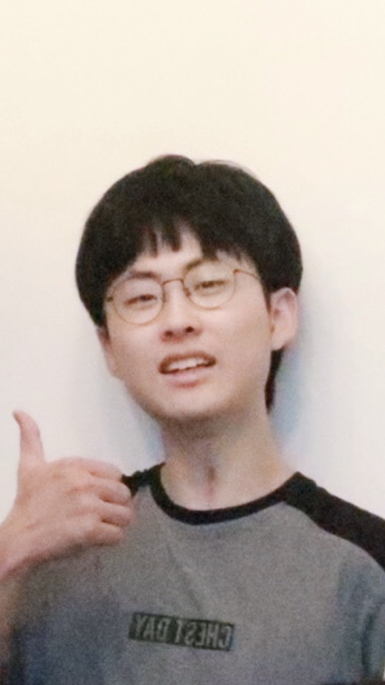
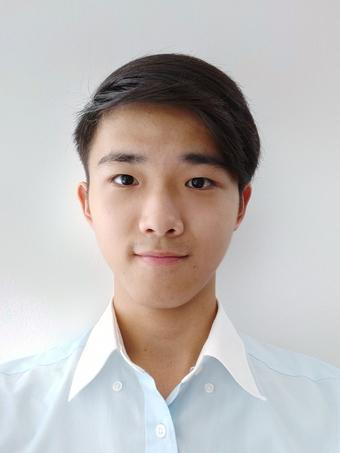
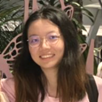

We are team T13-1 from [CS2103T](https://github.com/nus-cs2103-ay2021s2).

## Project team

### Lan Yu Xuan

[ [github](http://github.com/Jellybeano) ] [ [portfolio](team/lanyuxuan.md) ]

* Role: Team Lead
* Responsibilities: Documentation

### Joel Wong Xue Rong

[ [github](http://github.com/Yanneko) ]
[[portfolio](team/JWong.md)]

* Role: Developer
* Responsibilities: Testing

### Sun Yucheng

[[github](http://github.com/cheng20010201)]
[[portfolio](team/cheng20010201.md)]

* Role: Developer
* Responsibilities: Integration, Scheduling and Tracking

### Teng Xin Wei

[[github](http://github.com/xinweit)]
[[portfolio](team/tengxinwei.md)]

* Role: Developer
* Responsibilities: Documentation + Code quality

### Zhang Xinyi

[[github](https://github.com/xyzhang00)] [[portfolio](team/zhangxinyi.md)]

* Role: Developer
* Responsibilities: Code quality
