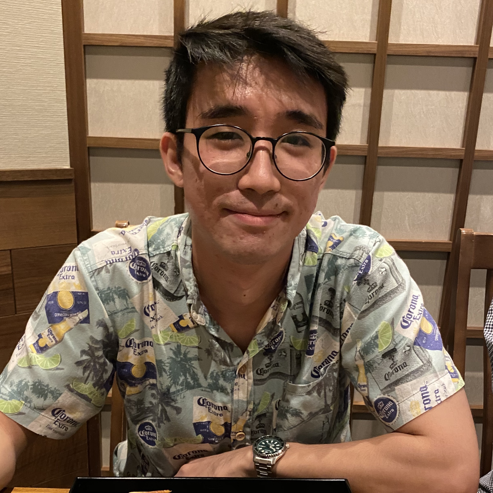
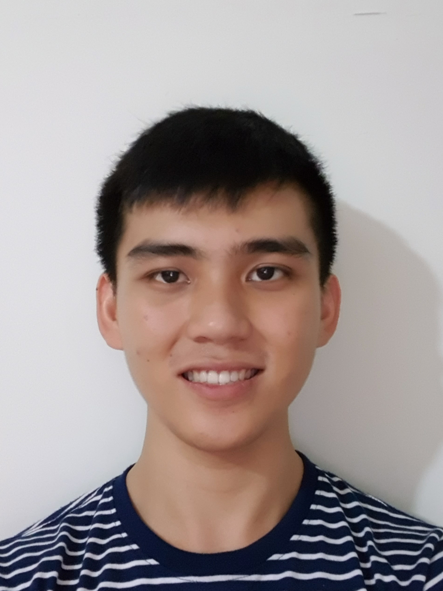
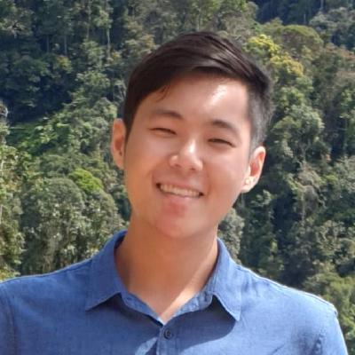
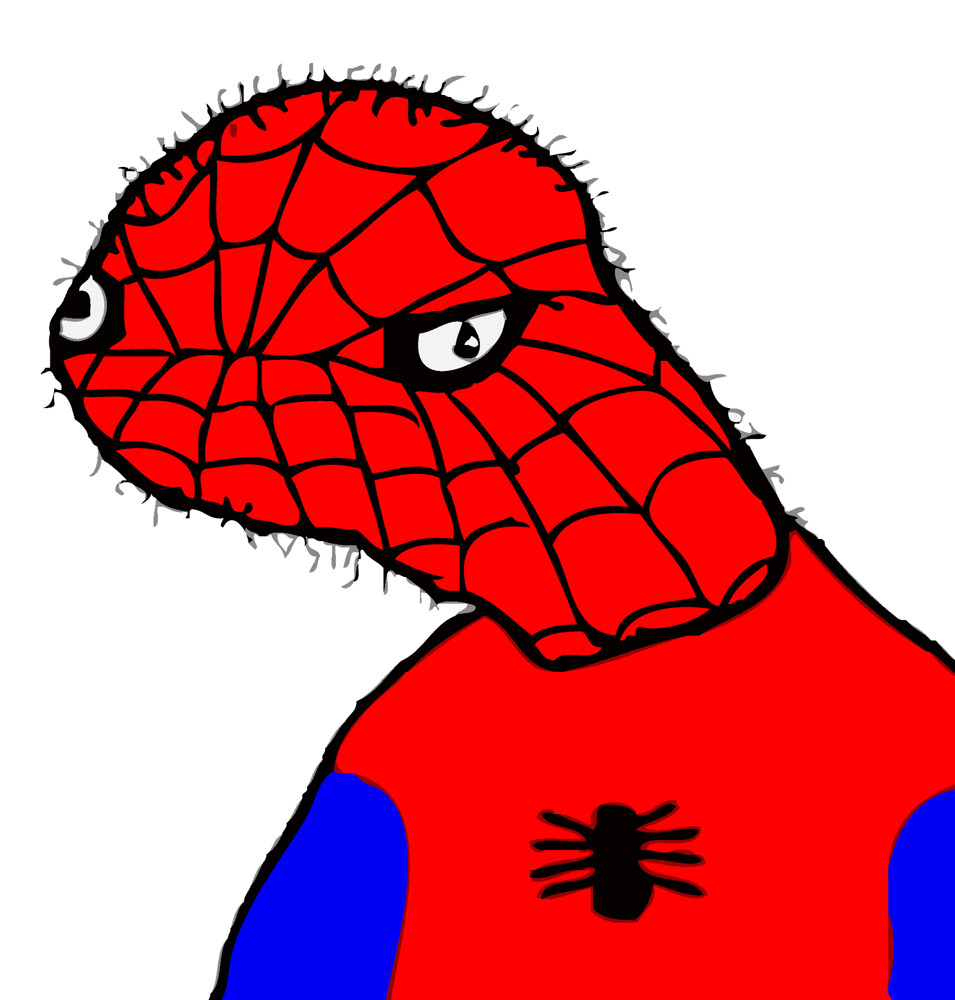

We are a team based in the [School of Computing, National University of Singapore](http://www.comp.nus.edu.sg).

You can reach us at the email `seer[at]comp.nus.edu.sg`

## Project team

### Keng Iuan

[[github](http://github.com/darkdestry-t)][[portfolio](team/darkdestry-t)]

* Role: Team Leader
* Responsibilities: Storage

### Justin Gnoh

[[github](http://github.com/justgnohUG)][[portfolio](team/justgnohug.md)]
<!-- [[portfolio](team/johndoe.md)] -->

* Role: Production
* Responsibilities: UI

### Boon Ji

[[github](https://github.com/tanboonji)]
[[portfolio](team/tanboonji)]

* Role: Documentation
* Reponsibilities: Logic (excluding Commands)

### Yi Ping

[[github](http://github.com/oeiyiping)]
[[portfolio](team/oeiyiping)]

* Role: Documentation
* Responsibilities: Model, Commands

### Yao Wei

[[github](https://github.com/yaowei-soc)]
[[portfolio](team/yaowei-soc)]

* Role: Documentation
* Responsibilities: Test
