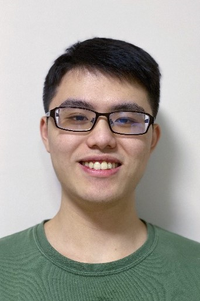

We are a team based in the [School of Computing, National University of Singapore](http://www.comp.nus.edu.sg).

## Project team

### Jason Tay

[[github](https://github.com/jay9645)]

* Role: Developer

### Jeremy Lee

[[github](http://github.com/jlxw48)]

* Role: Developer
* Responsibilities: UI

### Ng Boon Hong

[[github](http://github.com/NBH99)] 

* Role: Developer
* Responsibilities: Data

### Swa Yong Shen

[[github](http://github.com/swayongshen)]

* Role: Developer
* Responsibilities: Dev Ops + Threading

### Wong Kok Ian

[[github](http://github.com/wongkokian)]

* Role: Developer
* Responsibilities: UI
