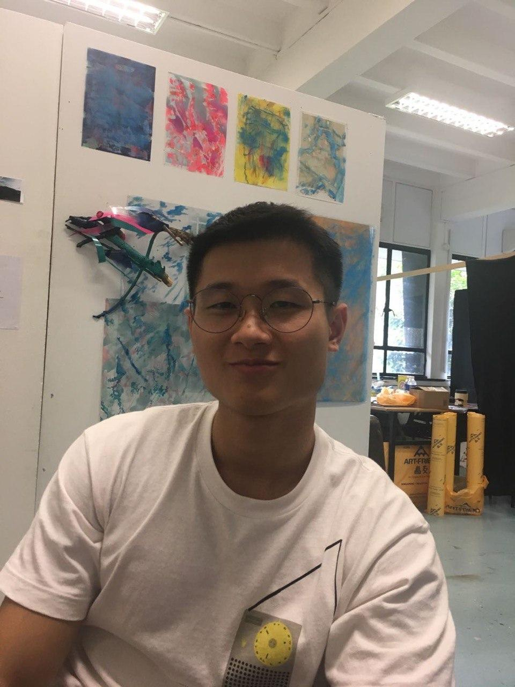
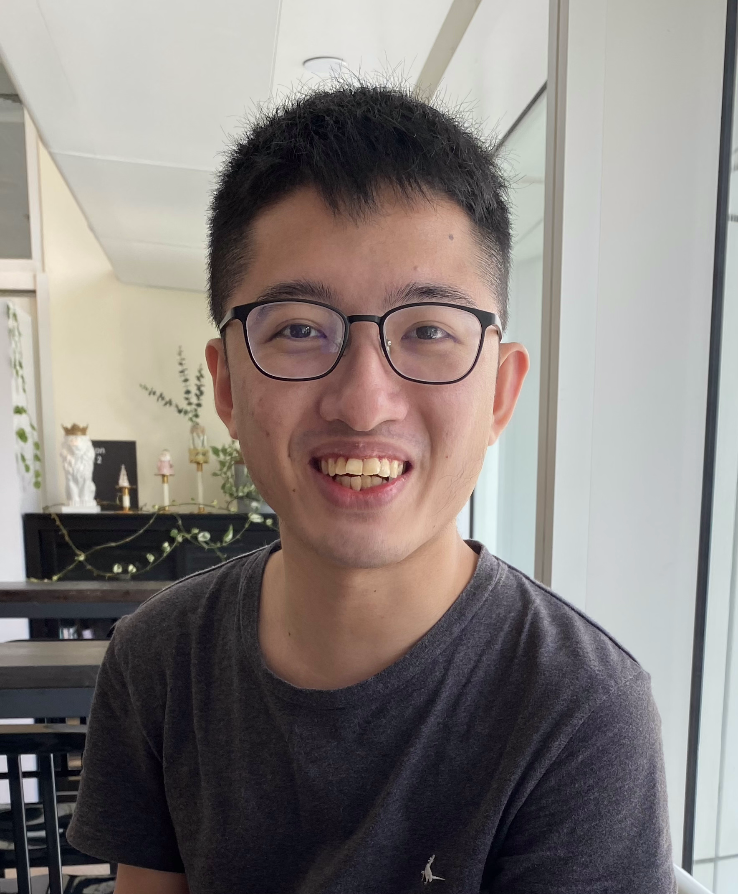

ImPoster developer team is based in the [School of Computing, National University of Singapore](http://www.comp.nus.edu.sg).

You can reach us at the email `imposter@comp.nus.edu.sg`

## Project team

### Juliet Teoh

[[Github](http://github.com/JulietTeoh)]
[[Portfolio](team/julietteoh.md)]

* Role: Developer
* Responsibilities: Update existing AB3 commands and documentation

### Liu Yongliang

[[Github](http://github.com/tlylt)]
[[Portfolio](team/tlylt.md)]

* Role: Developer
* Responsibilities: Update new features and ensure code quality

### Ong Jun Xiong

[[Github](http://github.com/ong6)]
[[Portfolio](team/ong6.md)]

* Role: Developer
* Responsibilities: Update existing AB3 commands and documentation

### Tan Jin

[[Github](http://github.com/tjtanjin)]
[[Portfolio](team/tjtanjin.md)]
[[Homepage](https://tjtanjin.com)]

* Role: Developer
* Responsibilities: Update new features and ensure smooth integrations

### Warren Ng

[[Github](http://github.com/nightraven49)]
[[Portfolio](team/nightraven49.md)]

* Role: Developer
* Responsibilities: Update user interface and provide quality assurance
