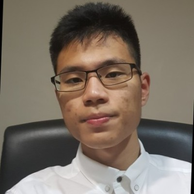
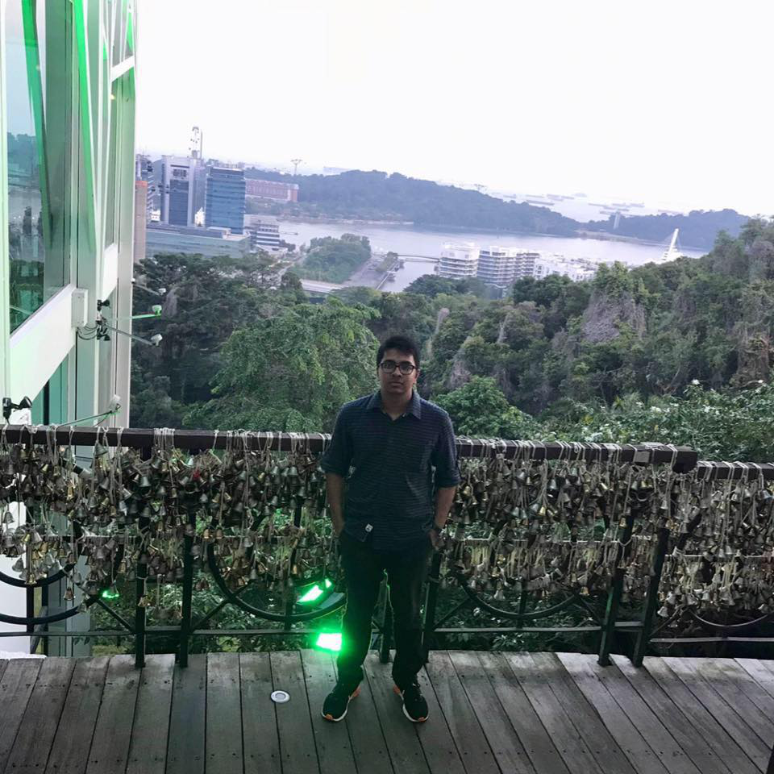
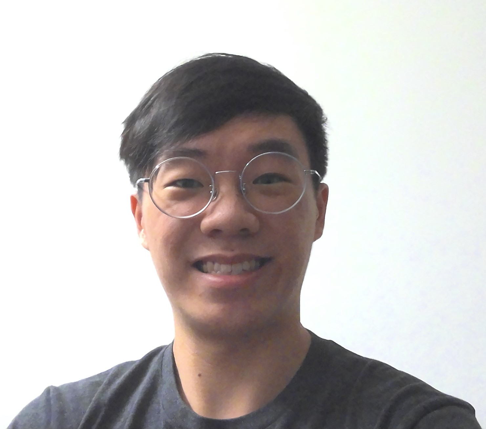

We are a team based in the [School of Computing, National University of Singapore](http://www.comp.nus.edu.sg).

You can reach us at the email `jdlian505[at]gmail.com`, `juhaeradittya2000[at]gmail.com`, `galencheung97@gmail.com`

## Project team

### Lian Jiade

[[github](https://github.com/CSjiade)]
[[portfolio](team/lianjiade.md)]

* Role: Developer
* Responsibilities: In charge of UI, Logic, Storage

###  Md Juhaer Adittya Pasha

[[github](http://github.com/johndoe)]
[[portfolio](team/pasha-292.md)]

* Role: Developer
* Responsibilities: UI, Logic, Storage, Testing

### Galen Cheung

[[github](http://github.com/cheunggalen)] [[portfolio]()]

* Role: Developer
* Responsibilities: UI, Logic

### Ng Han Poh Jacob

[[github](http://github.com/johndoe)]
[[portfolio]()]

* Role: Developer
* Responsibilities: Dev Ops + Threading

