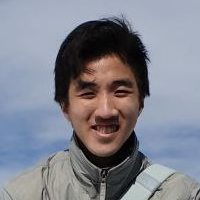
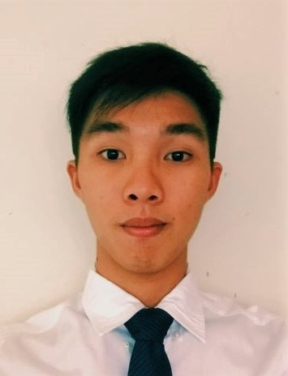
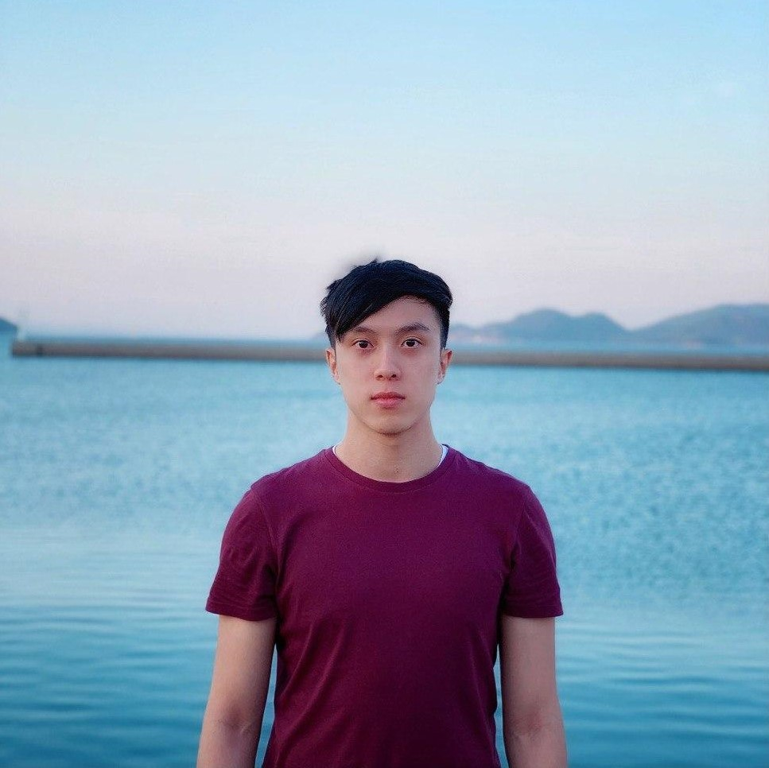
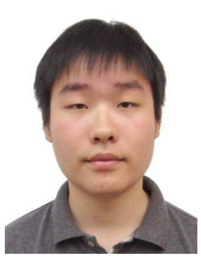

We are a team based in the [School of Computing, National University of Singapore](http://www.comp.nus.edu.sg).

## Project team

### Onn Wei Sin

[[github](http://github.com/onnwards)]
[[portfolio](team/onnwards.md)]

* Role: Developer
* Responsibilities: Scheduling and Tracking, VSCode Expert, Git Expert, In charge of UI
* Backup Responsibilities: Code Quality, Testing, Integration

### Pang Jiarong, Jacob

[[github](http://github.com/Jacob-Pang)]
[[portfolio](team/jacob-pang.md)]

* Role: Developer
* Responsibilities: App Architecture
* Backup Responsibilities: Progress Checking

### Chia Jia-Xi, Kymie

[[github](http://github.com/kwmiw)]
[[portfolio](team/kwmiw.md)]

* Role: Developer
* Responsibilities: Integration, Documentation
* Backup Responsibilities:

### Png Zheng Jie, Sebastian

[[github](https://github.com/pngsebastian)]
[[portfolio](team/pngsebastian.md)]

* Role: Developer
* Responsibilities: Documentation
* Backup Responsibilities:

### Zhang Peng

[[github](https://github.com/icytornado)]
[[portfolio](team/icytornado.md)]

* Role: Developer
* Responsibilities: Code Quality, Integration
* Backup Responsibilities:
