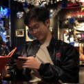
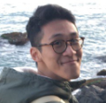
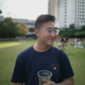

We are a team based in the [School of Computing, National University of Singapore](http://www.comp.nus.edu.sg).

You can reach us at the email `chewterence@u.nus.edu`

## Project team

### Yue Yang Lee

[Homepage](https://www.lyueyang.space) | [Github](https://github.com/lyueyang) | [Portfolio](team/lyueyang.md)

* Role: Integration
* Responsibilities: In charge of CRD commands

### Joel Ho

[Homepage](https://www.joels.space) | [Github](http://github.com/joelho) | [Portfolio](team/joelho.md)

* Role: Code Quality
* Responsibilities: In charge of UI

### Zechariah Tan

[Homepage](https://www.zechariahtan.com) | [Github](http://github.com/zechariahtan) | [Portfolio](team/zechariahtan.md)

* Role: Testing
* Responsibilities: In charge of Storage

### Terence Chew

[Homepage](https://www.chewterence.com) | [Github](http://github.com/chewterence) | [Portfolio](team/chewterence.md)

* Role: Team Lead
* Responsibilities: In charge of Model

### Mark Wong

[Github](http://github.com/markmcwong) | [Portfolio](team/markmcwong.md)

* Role: Documentation
* Responsibilities: In charge of Logic
