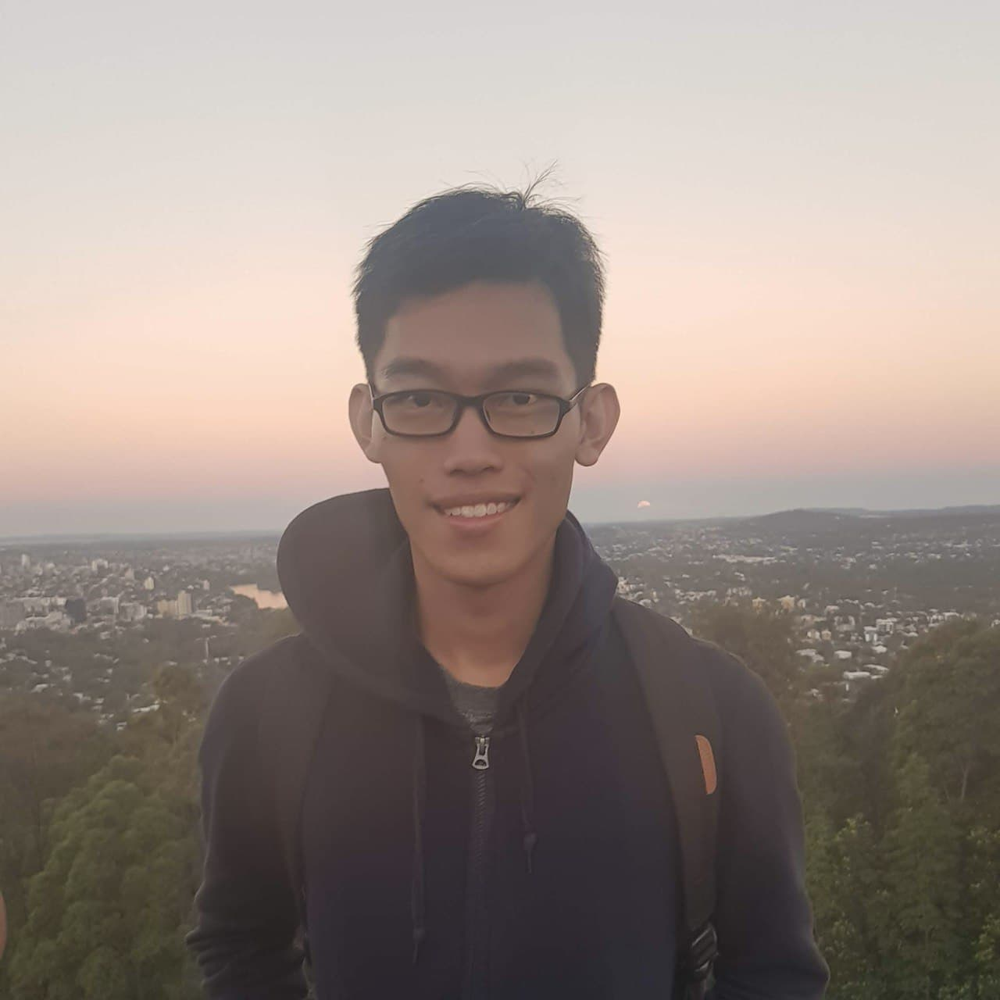
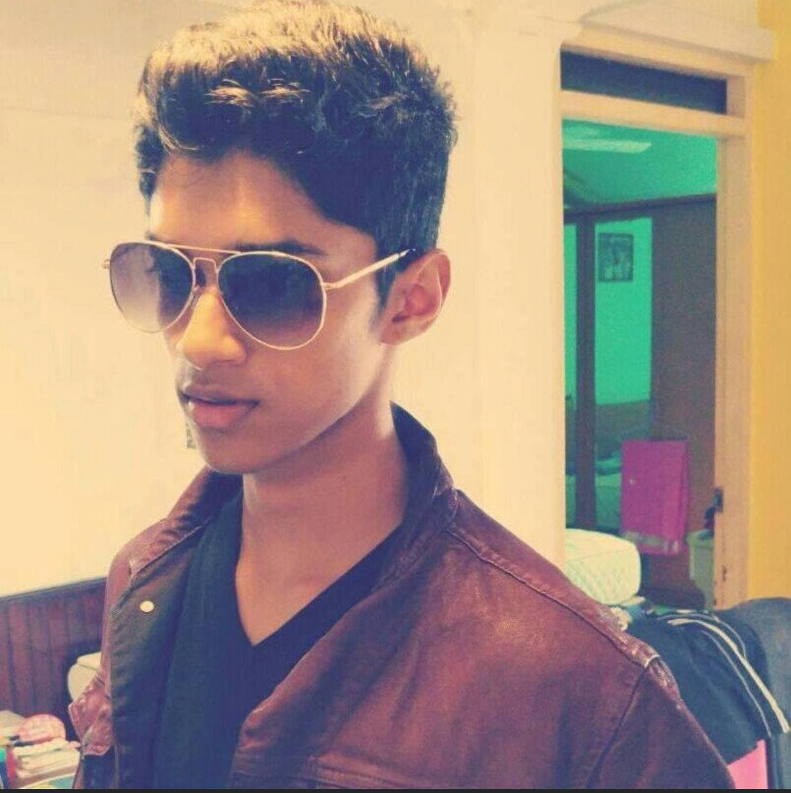

We are a team based in the [School of Computing, National University of Singapore](http://www.comp.nus.edu.sg).

You can reach us at the email `seer[at]comp.nus.edu.sg`

## Project team

### Cao Jiahao, Jonathan

[[github](https://github.com/Jonathan-Cao)]

* Role: Developer
* Responsibilities: UI, Storage

### Banerjee Aditya

[[github](https://github.com/adidoesnt)]

* Role: Developer
* Responsibilities: Logic (Parser)

### Arihant Jain

[[github](https://github.com/arihantjain97)]

* Role: Developer
* Responsibilities: Model

### Visnu S/O Ravindran

[[github](https://github.com/VisnuRavi)]

* Role: Developer
* Responsibilities: Logic (Commands)
