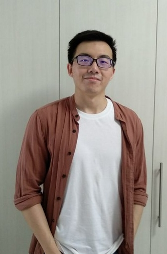
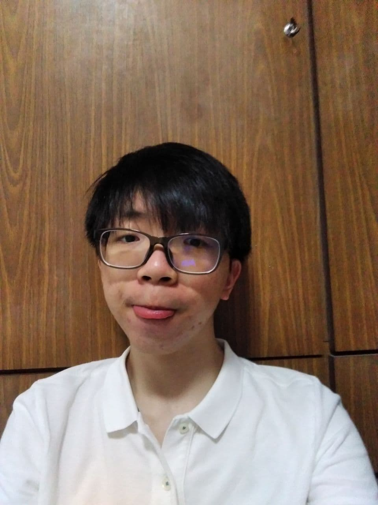
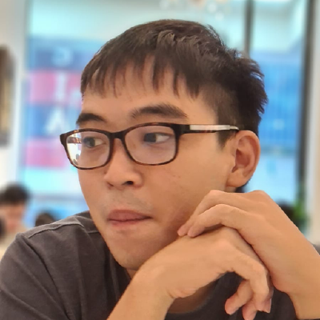
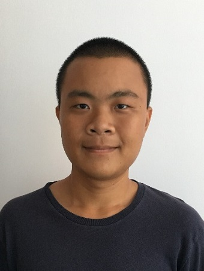
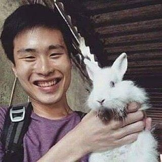

We are a team from NUS School of Computing completing this as a module requirement for CS2103/T.

You can reach us by creating a new issue on our [GitHub issues page](https://github.com/AY2021S2-CS2103T-T12-2/tp/issues).

## Project team

### Soh Jun Qi

[[github](https://github.com/sjq-sohjunqi)]

* Role: Team Lead
* Responsibilities: Testing (Primary), Documentation (Primary), Model (Primary), UI (Primary), Parsing (Secondary)

### Kuah Wei Liang

[[github](https://github.com/WeiLiangLOL/)]

* Role: Assistant Team Lead
* Responsibilities: Processing (Primary), Testing (Secondary), Code quality (Secondary)

### Song Soon Wee

[[github](https://github.com/ssoonwee)]

* Role: Developer
* Responsibilities: Parsing (Primary), UI (Secondary), Model (Secondary)

### Neo Soon Keat

[[github](https://github.com/SoonKeatNeo)]

* Role: Developer
* Responsibilities: Code quality (Primary), Processing (Secondary), Storage (Secondary)

### Jason Lim

[[github](https://github.com/jasaaanlim)]

* Role: Developer
* Responsibilities: Storage (Primary), Documentation (Secondary), Processing (Secondary)
