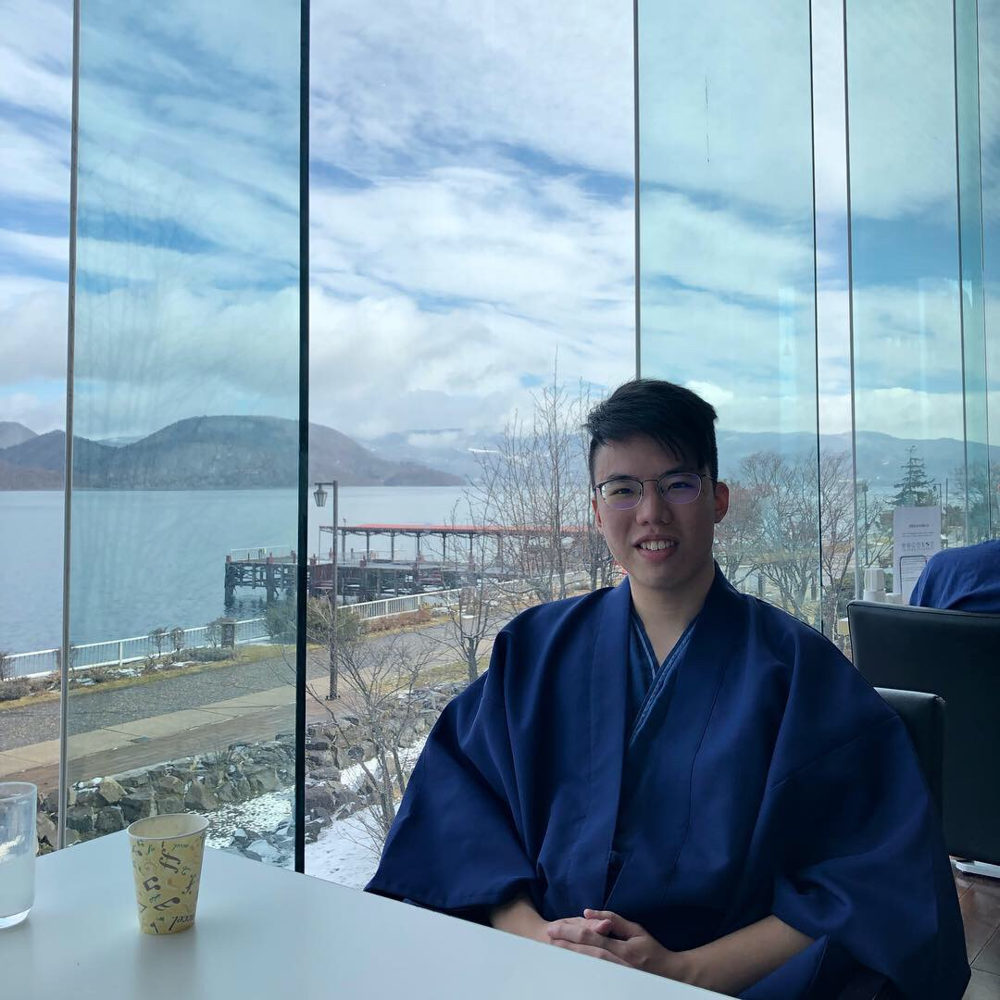
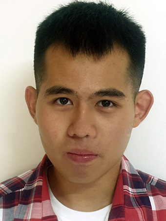
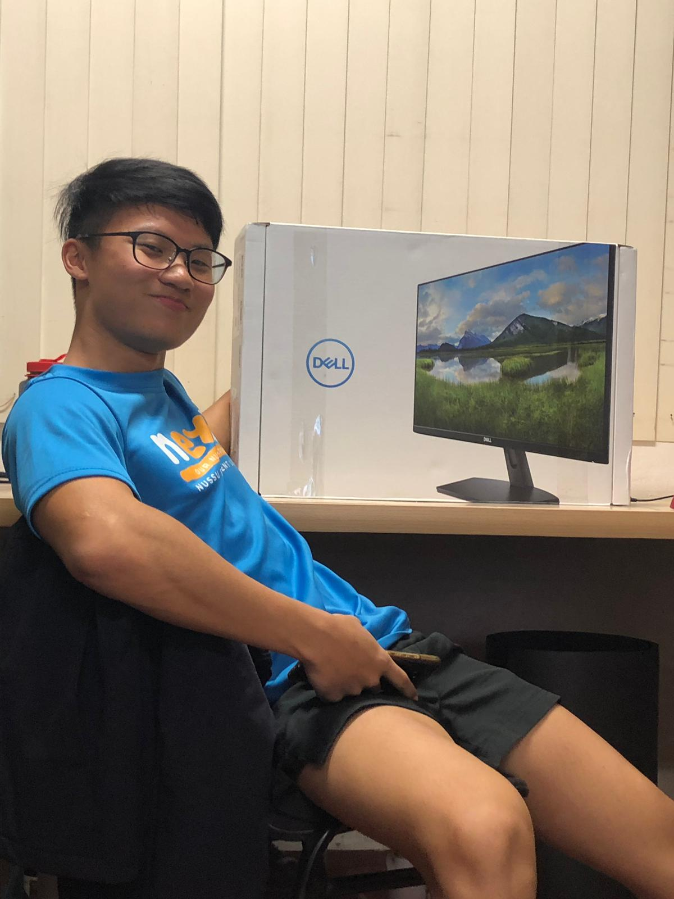

We are a team based in the [School of Computing, National University of Singapore](http://www.comp.nus.edu.sg).

## Project team

### Max Ng

[[github](https://github.com/maxxng)]
[[portfolio](team/maxxng.md)]

* Role: Developer
* Responsibilities: Integration / Code Quality / Testing

### Lee Han Bin

[[homepage](http://www.comp.nus.edu.sg/~habi39)]
[[github](https://github.com/habi39)]
[[portfolio](team/habi39.md)]
* Role: Team Lead / Developer
* Responsibilities: Integration / Testing

### Tay Kai Xiang

[[github](http://github.com/kaixiangtay)]
[[portfolio](team/kaixiangtay.md)]

* Role: Developer
* Responsibilities: Code Quality / Deliverables and Deadline / Scheduling and Tracking

### Lau Cheuk Ying

[[github](http://github.com/mesyeux/ip)]
[[portfolio](team/mesyeux.md)]

* Role: Developer
* Responsibilities: Documentation / Testing

### Lim Junxue

[[github](http://github.com/LimJunxue)]
[[portfolio](team/limjunxue.md)]

* Role: Developer
* Responsibilities: Testing / Code Quality
