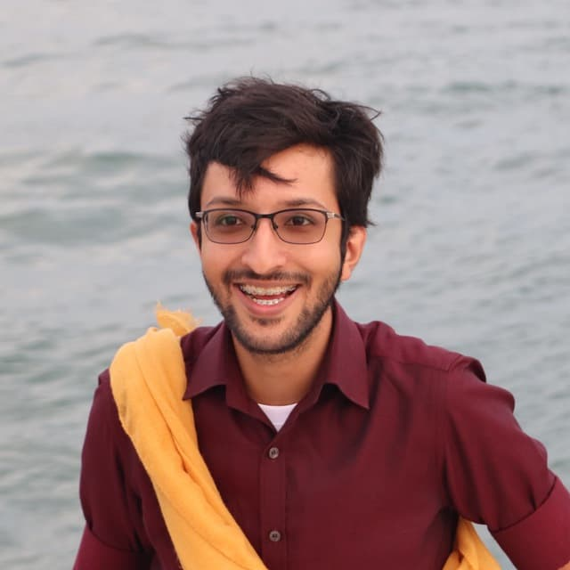
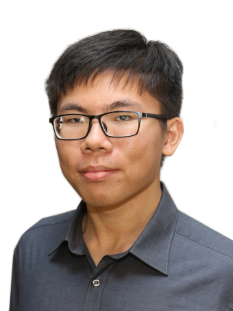
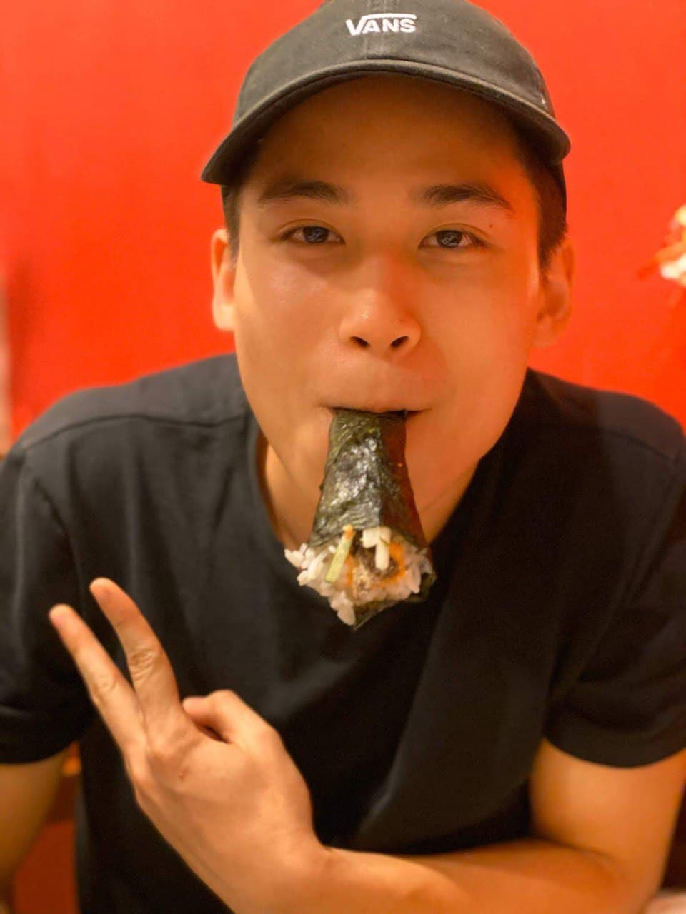

We are a team based in the [School of Computing, National University of Singapore](http://www.comp.nus.edu.sg).

You can reach us at the email `seer[at]comp.nus.edu.sg`

## Project team

### Azeem Vasanwala

[[github](https://github.com/DrWala)]
[[portfolio](team/azeem.md)]

* Role: TBD
* Responsibilities: TBD

### Benedict Khoo

[[github](https://github.com/benedictkhoomw)]
[[portfolio](team/benedict.md)]

* Role: TBD
* Responsibilities: TBD

### Colin Tan

[[github](https://github.com/colintkn)]
[[portfolio](team/colin.md)]

* Role: TBD
* Responsibilities: TBD

### Ian Soo

[[github](https://github.com/stein414)]
[[portfolio](team/ian.md)]

* Role: TBD
* Responsibilities: TBD

### Linh

[[github](https://github.com/cnlinh)]
[[portfolio](team/linh.md)]

* Role: TBD
* Responsibilities: TBD
