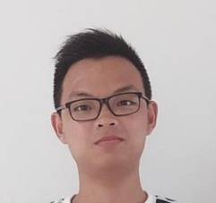

We are a team based in the [School of Computing, National University of Singapore](http://www.comp.nus.edu.sg).

You can reach us at the email `e0406389@u.nus.edu`

## StoreMando Project Team

### Chen Yan Jia Jay

[[github](https://github.com/JayChenYJ)]
[[portfolio](team/jaychenyj.md)]

* Role & Responsibilities: Team Lead, Scheduling and tracking, Deliverables and deadlines

### Chew Wei Hao

[[github](http://github.com/chewwh09)]
[[portfolio](team/chewwh09.md)]

* Roles and Responsibilities: Logic expert, Code Quality, Documentation

### Mohamed Fazil

[[github](http://github.com/Md-Fazil)] [[portfolio](team/mohamedfazil.md)]

* Roles & Responsibilities: In charge of documentation and integration. Git Expert.

### Kumaran S/O Selvvaratnam

[[github](http://github.com/kumsssss)]
[[portfolio](team/kumaran.md)]

* Role & Responsibilities: In charge of Code Quality and Model, Testing Expert

### Amanda Ang Yee Min

[[github](http://github.com/github-amanda)]
[[portfolio](team/amandaang.md)]

* Roles & Responsibilities: UI Expert, Testing Expert & SourceTree Expert
