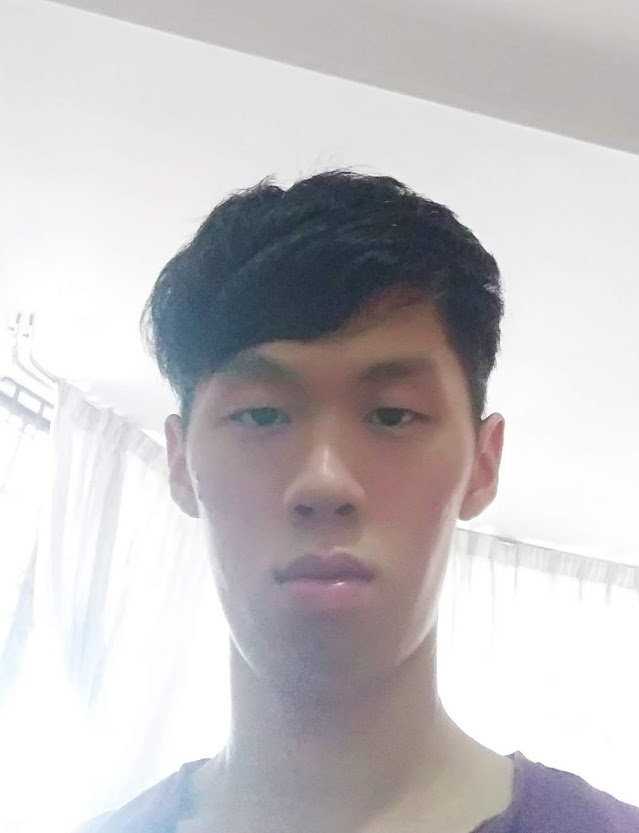

We are a team based in the [School of Computing, National University of Singapore](http://www.comp.nus.edu.sg).

You can reach us at the email `seer[at]comp.nus.edu.sg`

## Project team

### Charles Lee Lin Ta

[[github](https://github.com/CharlesLee01)]

* Role: Developer
* Responsibilities: Add command

### Jane Doe

[[github](http://github.com/johndoe)]
[[portfolio](team/johndoe.md)]

* Role: Team Lead
* Responsibilities: UI

### Johnny Doe

[[github](http://github.com/johndoe)] [[portfolio](team/johndoe.md)]

* Role: Developer
* Responsibilities: Data

### Lam Xuan Yi, Shaelyn

[[github](http://github.com/shaelynl)]

* Role: Developer
* Responsibilities: Help command

### James Doe

[[github](http://github.com/johndoe)]
[[portfolio](team/johndoe.md)]

* Role: Developer
* Responsibilities: UI

### Zhang Anli

[[github](http://github.com/ZhangAnli)]

* Role: Developer
* Responsibilities: Delete command
