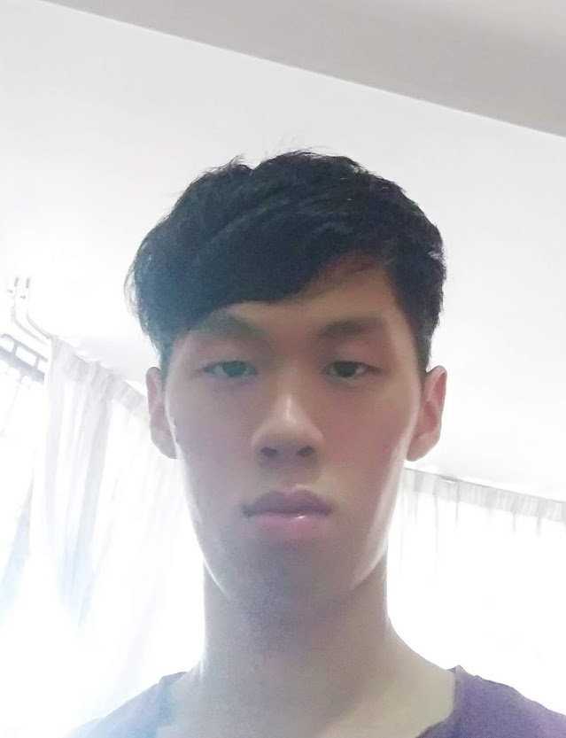
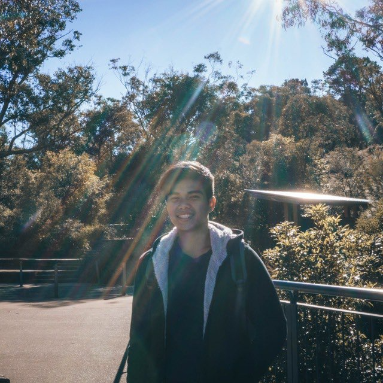
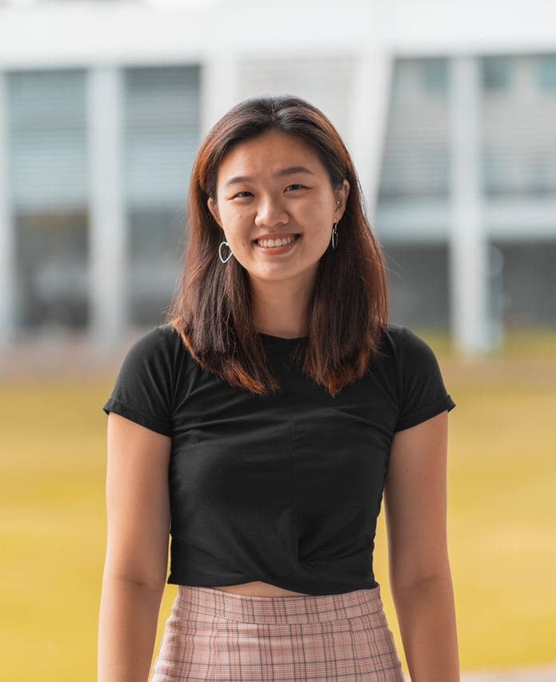
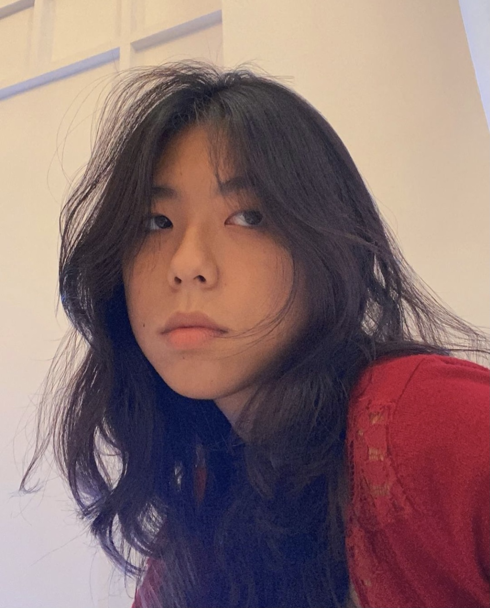

We are a team based in the [School of Computing, National University of Singapore](http://www.comp.nus.edu.sg).

## Project team

### Charles Lee Lin Ta

[[github](https://github.com/CharlesLee01)]
[[portfolio](team/charleslee.md)]

* Role: Developer
* Responsibilities: Add command

### John Alec Mendoza Branzuela

[[github](http://github.com/branzuelajohn)]
[[portfolio](team/branzuelajohn.md)]

* Role: Developer
* Responsibilities: Command Summary

### Kou Yong Kang

[[github](http://github.com/kouyk)] [[portfolio](team/yongkang.md)]

* Role: Developer
* Responsibilities: Data

### Lam Xuan Yi, Shaelyn

[[github](http://github.com/shaelynl)]
[[portfolio](team/shaelynlam.md)]

* Role: Developer
* Responsibilities: Help command

### Wei Yutong

[[github](http://github.com/wei-yutong)]
[[portfolio](team/weiyutong.md)]

* Role: Developer
* Responsibilities: Exit Command

### Zhang Anli

[[github](http://github.com/ZhangAnli)]
[[portfolio](team/zhanganli.md)]

* Role: Developer
* Responsibilities: Delete command
