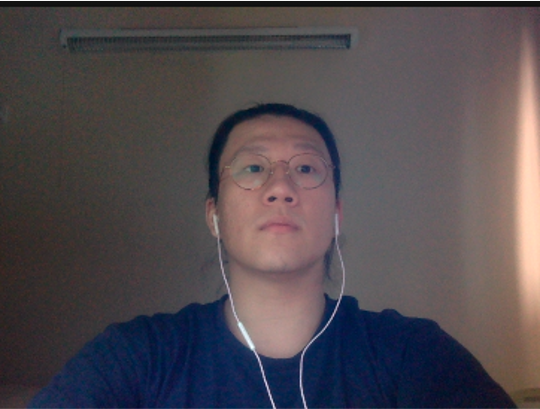

HeliBook is a application that stores, manages and allows for quick access to your child's important contacts. 

We are the team behind HeliBook. We are based in the [School of Computing, National University of Singapore](http://www.comp.nus.edu.sg).

## Project team

### Liao Xing Peng

[[github](http://github.com/mechastriker3)]
[[portfolio](team/mechastriker3.md)]

* Role: Team Lead
* Responsibilities: Adding Contacts

### Clarissa Lee

[[github](http://github.com/clarlzx)] [[portfolio](team/clarlzx.md)]

* Role: Deliverables and deadlines
* Responsibilities: Search Contacts

### Edeline Tenges

[[github](http://github.com/edelinetenges)]
[[portfolio](team/edelinetenges.md)]

* Role: Graphics and Design
* Responsibilities: UI, Sorting Contacts

### Huang Weicong

[[github](http://github.com/Stratostorm)]
[[portfolio](team/stratostorm.md)]

* Role: Testing, Code Quality
* Responsibilities: Tagging Contacts

### Nicole Ang

[[github](http://github.com/nicoleang09)]
[[portfolio](team/nicoleang09.md)]

* Role: Documentation
* Responsibilities: UI, Help Function
