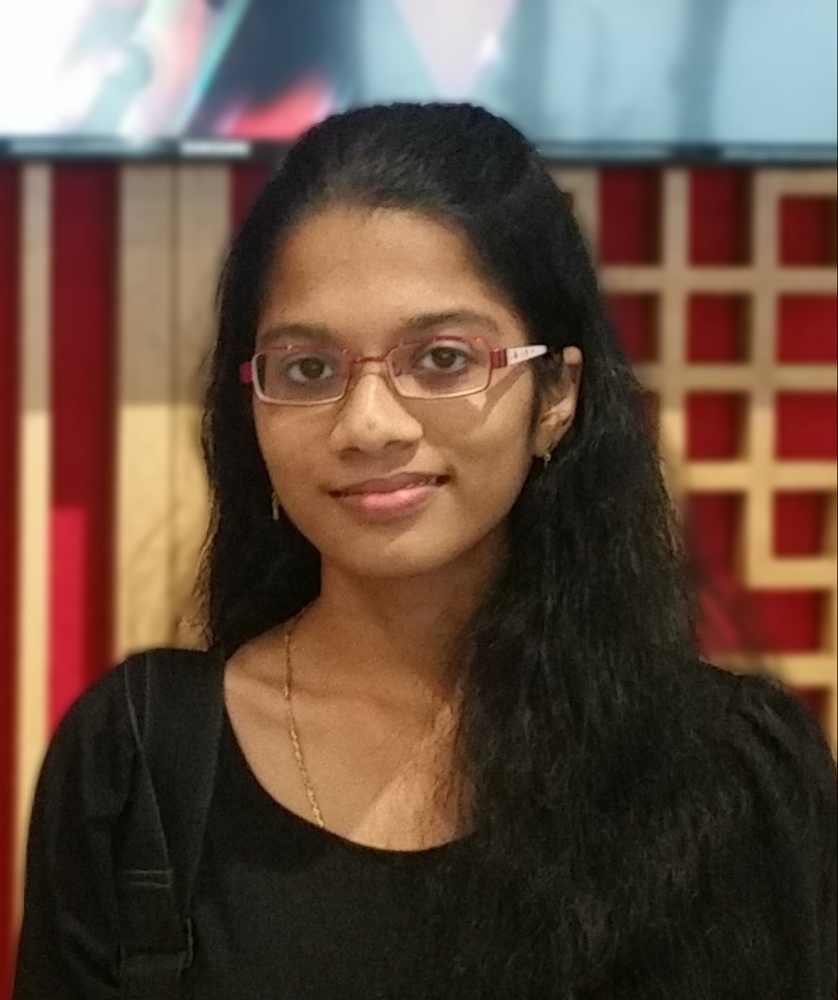
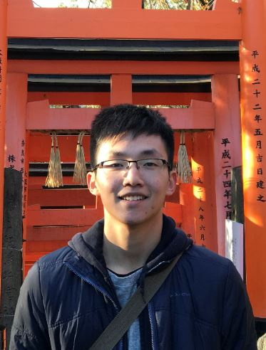
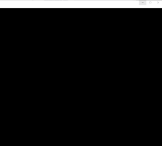
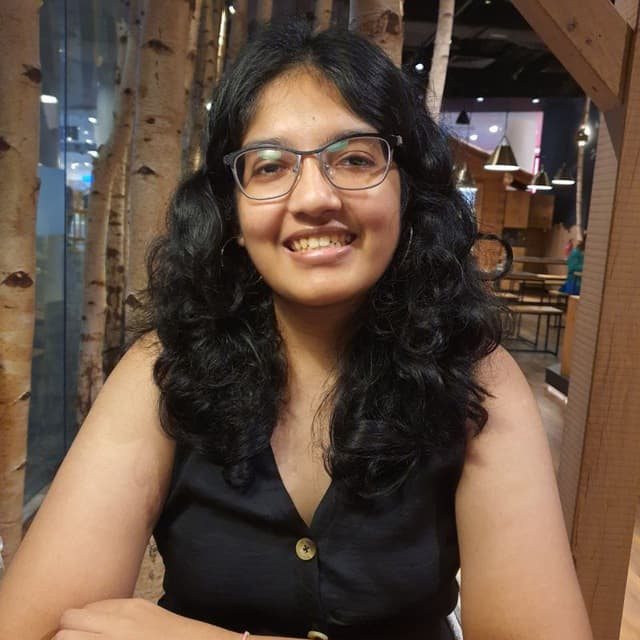

We are a team based in the [School of Computing, National University of Singapore](http://www.comp.nus.edu.sg).

You can reach us at the email `seer[at]comp.nus.edu.sg`

## Project team

### Priscilla

[[github](http://github.com/ppris)]
[[portfolio](team/ppris.md)]

* Role: Team Lead, Deliverables and Scheduling 
* Responsibilities: Model

### Soh Xin Wei

[[github](http://github.com/xiinweii98)]
[[portfolio](team/xiinweii98.md)]

* Role: Developer, Testing
* Responsibilities: Logic

### Lim Rui Xiong

[[github](http://github.com/RuiXiong2211)] 
[[portfolio](team/ruixiong2211.md)]

* Role: Developer, Documentation
* Responsibilities: Commons

### Pavitra

[[github](http://github.com/pavz02)]
[[portfolio](team/pavz02.md)]

* Role: Developer, Code quality
* Responsibilities: Ui and JavaFX

### Bhadani Simran

[[github](http://github.com/simran-bhadani3)]
[[portfolio](team/simran-bhadani3.md)]

* Role: Developer, Integration
* Responsibilities: Storage
