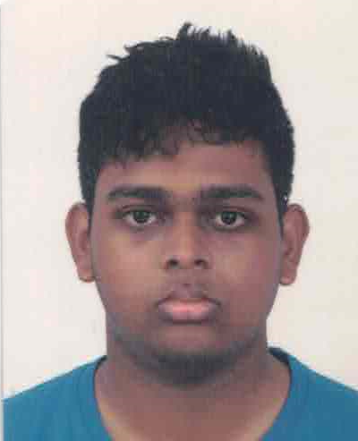
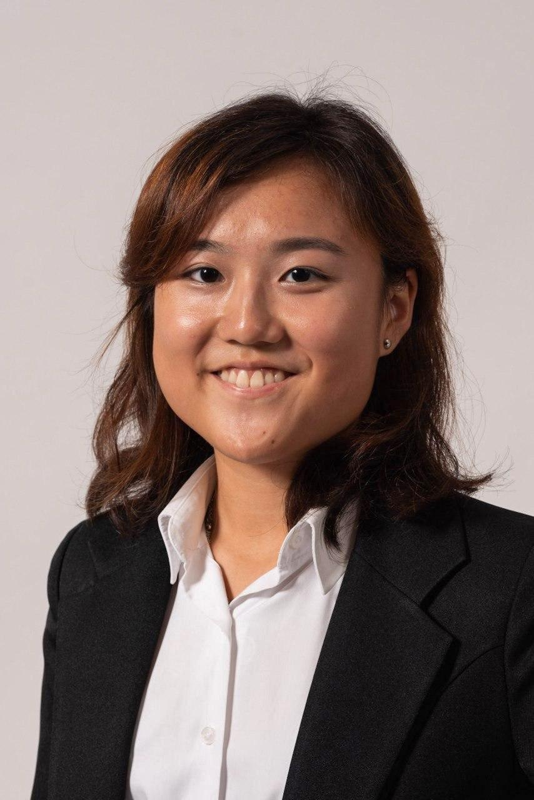
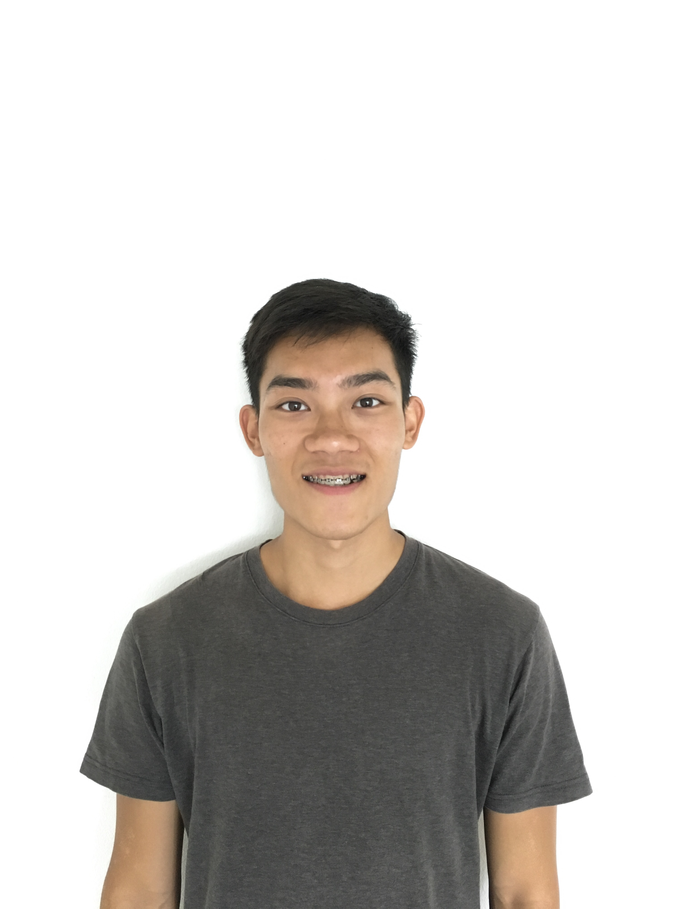

We are a team based in the [School of Computing, National University of Singapore](http://www.comp.nus.edu.sg).

You can reach us at the email `seer[at]comp.nus.edu.sg`

## Project team

### Prabhakaran Gokul

[[github](https://github.com/Prabhakaran-Gokul/)]
[[portfolio](team/johndoe.md)]

* Role: Developers
* Responsibilities: Integration
### Donavan Lim

[[github](https://github.com/Donavanty)]
[[portfolio](team/Donavan.md)]

* Role: Developer
* Responsibilities: Documentation

### Dinesh S/O Magesvaran

[[github](http://github.com/dineshmagesvaran)]
[[portfolio](team/dineshmagesvaran.md)]

* Role: Developer
* Responsibilities: Testing

### Johnny Doe

[[github](http://github.com/johndoe)] [[portfolio](team/johndoe.md)]

* Role: Developer
* Responsibilities: Data

### Chong Sidney

[[github](http://github.com/sidney011100)]
[[portfolio](team/sidney011100.md)]

* Role: Developer
* Responsibilities: Deliverables and Deadlines

### Marcus Lee Eugene

[[github](http://github.com/marcusleeeugene)]
[[portfolio](team/marcusleeeugene.md)]

* Role: Team Lead, Developer
* Responsibilities: Scheduling and tracking, Code quality 
* [Git] expert 
