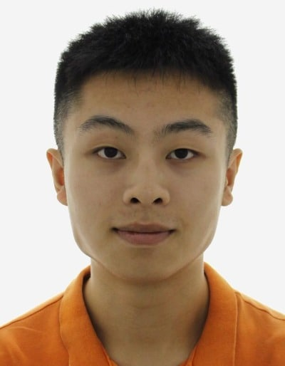
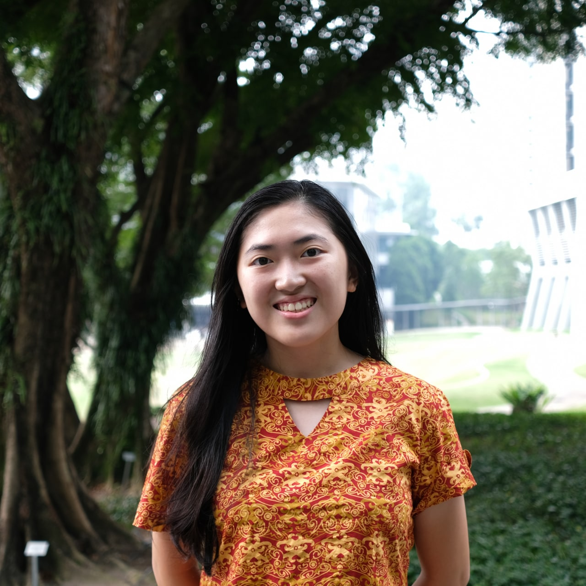
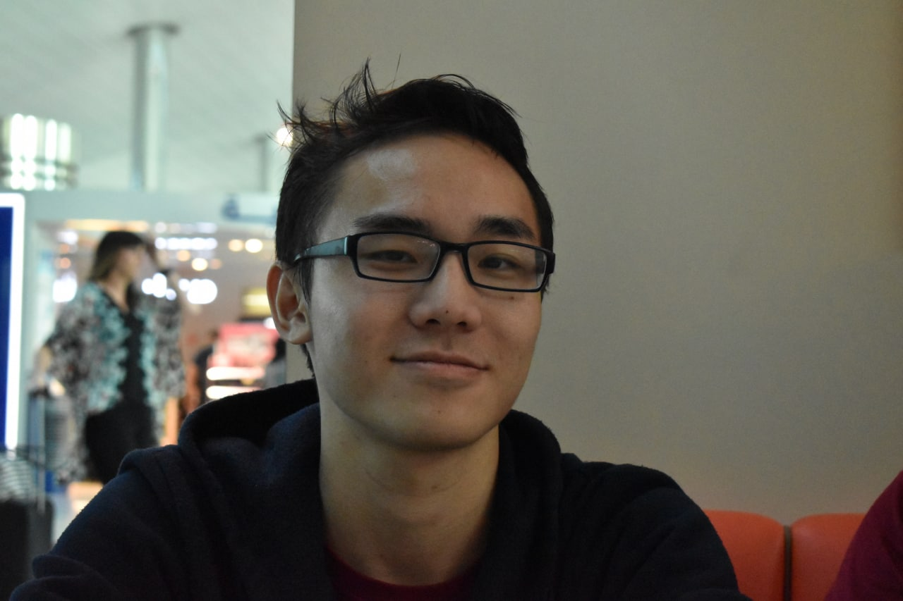
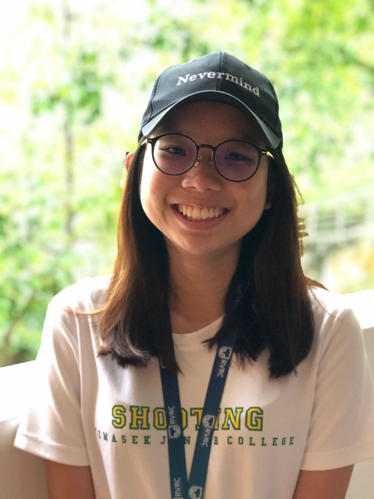
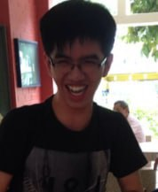

# About Us

We are a team based in the [School of Computing, National University of Singapore](http://www.comp.nus.edu.sg).

You can reach us at the email at our individual emails below!

## Project team

### Kelvin

[GitHub](https://github.com/zoeykobe) | [Portfolio](team/zoeykobe.md) | [Email](mailto:zhou_yi_kelvin@u.nus.edu)

* Role: Team Leader

### Friscilia

[GitHub](https://github.com/frisciliasultan) | [Portfolio](team/frisciliasultan.md) | [Email](mailto:frisciliasultan@u.nus.edu)

* Role: Developer
* Responsibilities: Testing

### Isaiah

[GitHub](https://github.com/Zaiah0505) | [Portfolio](team/Zaiah0505.md) | [Email](mailto:isaiah.koh@u.nus.edu)

* Role: Developer
* Responsibilities: Scheduling and Tracking, UI

### Jody

[GitHub](https://github.com/JodyLorah) | [Portfolio](team/jodylorah.md) | [Email](mailto:jodylorah@u.nus.edu)

* Role: Developer
* Responsibilities: Code Quality

### Qin Liang

[GitHub](http://github.com/Tomashiwa) | [Portfolio](team/Tomashiwa.md) | [Email](mailto:e0407322@u.nus.edu)

* Role: Developer
* Responsibilities: Integration

### Shaun

[GitHub](http://github.com/Juzzanoob) | [Portfolio](team/Juzzanoob.md) | [Email](mailto:e0418165@u.nus.edu)

* Role: Developer
* Responsibilities: Documentation
