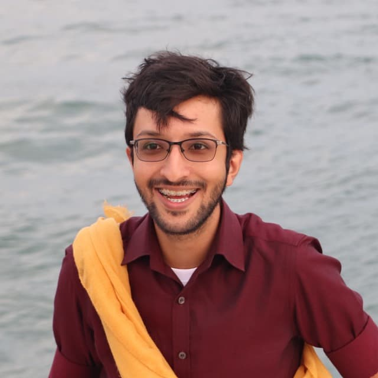
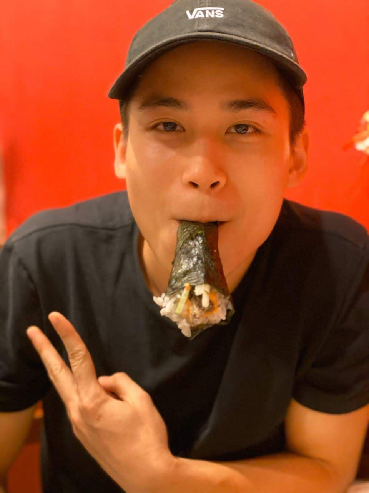
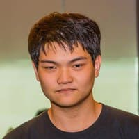
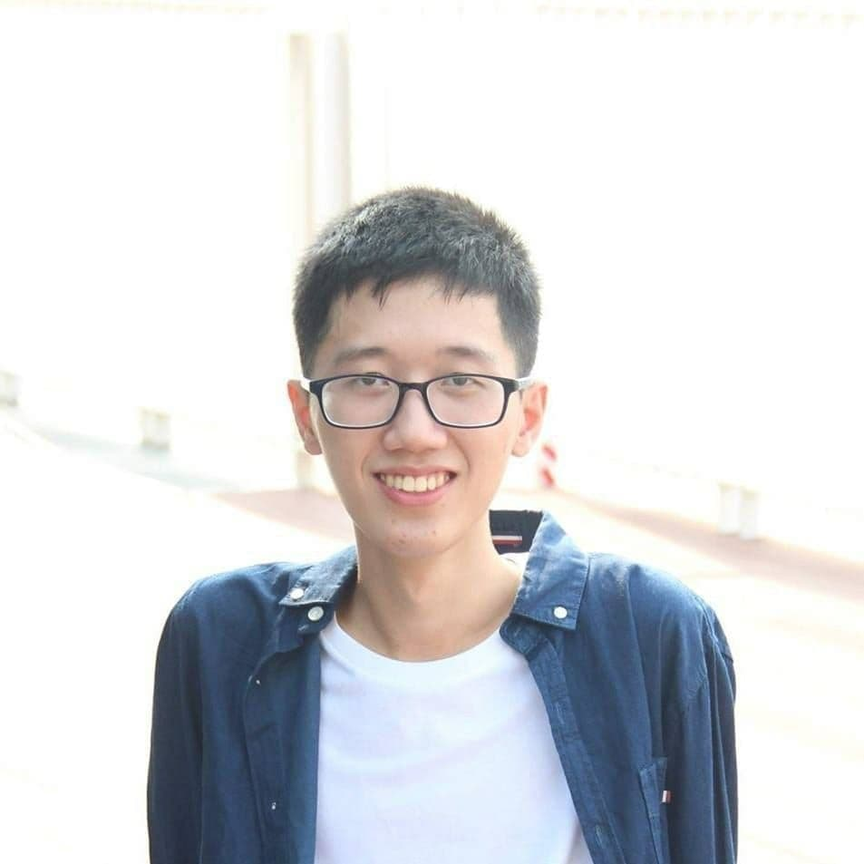

We are a team based in the [School of Computing, National University of Singapore](http://www.comp.nus.edu.sg).

You can reach us at the email `e0205114[at]comp.nus.edu.sg`

## Project team

### Azeem Arshad Vasanwala

[[github](https://github.com/DrWala)]
[[portfolio](team/drwala.md)]

* Role: Developer
* Responsibilities: Testing, Rooms feature

### Khoo Ming Wei, Benedict

[[github](https://github.com/benedictkhoomw)]
[[portfolio](team/benedictkhoomw.md)]

* Role: Developer
* Responsibilities: Documentation, Undo/Redo Feature, Command History Feature

### Colin Tan

[[github](https://github.com/colintkn)]
[[portfolio](team/colintkn.md)]

* Role: Developer
* Responsibilities: Integration, Resident Feature

### Soo Qi Xuan Ian

[[github](https://github.com/stein414)]
[[portfolio](team/stein414.md)]

* Role: Developer, VS Code Expert
* Responsibilities: Code Quality, Issue Feature

### Cao Ngoc Linh

[[github](https://github.com/cnlinh)]
[[portfolio](team/cnlinh.md)]

* Role: Team Lead
* Responsibilities: Alias Feature
