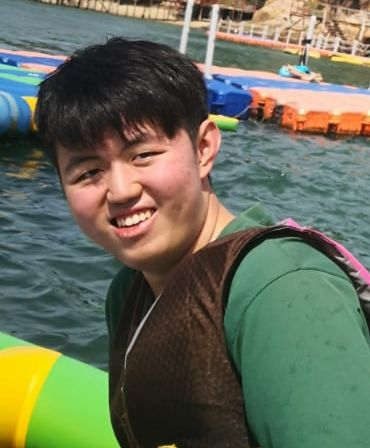
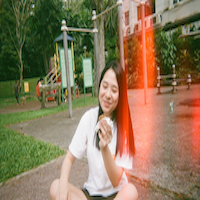
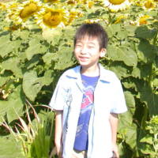
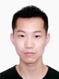

We are a team based in the [School of Computing, National University of Singapore](http://www.comp.nus.edu.sg).

## Project team

### Wang Yuchen

[[github](http://github.com/w-yuchen)]
[[portfolio](team/w-yuchen.md)]

* Role: Developer
* Responsibilities: Documentation, Testing

### Yeoh Hsin Ying Candice

[[github](http://github.com/candyhy)]
[[portfolio](team/candyhy.md)]

* Role: Developer
* Responsibilities: Scheduling and tracking

### Tan Jun Wei

[[github](http://github.com/w2vgd)]
[[portfolio](team/w2vgd.md)]

* Role: Team Lead, Developer
* Responsibilities: Deliverables and deadlines

### David Au Wei En

[[github](http://github.com/dvdweien)]
[[portfolio](team/dvdweien.md)]

* Role: Developer
* Responsibilities: Integration

### Cao Peng

[[github](http://github.com/cp-john)]
[[portfolio](team/cp-john.md)]

* Role: Developer
* Responsibilities: Code Quality
