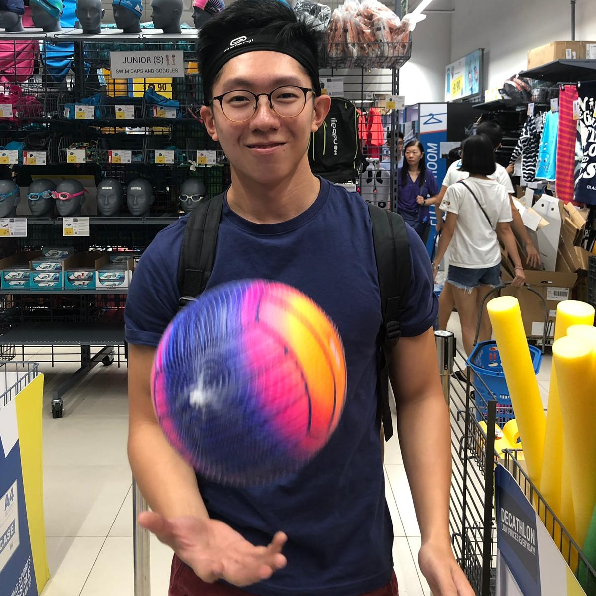
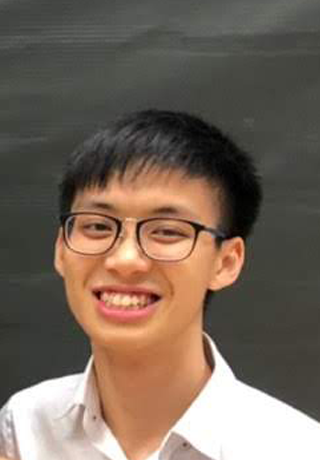
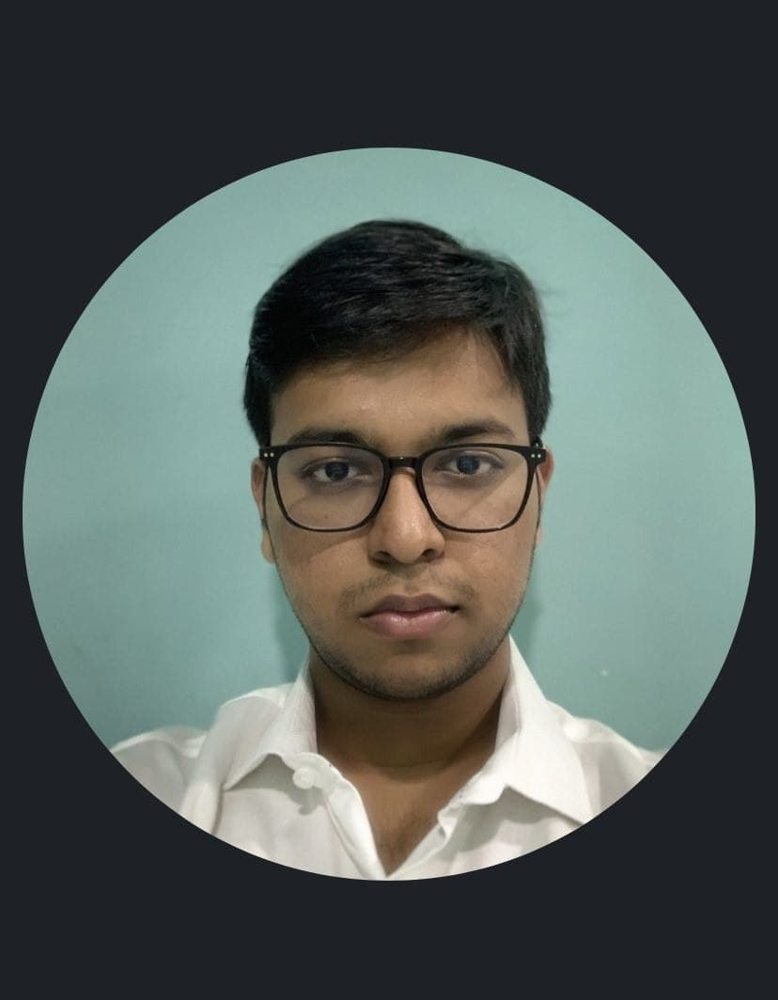
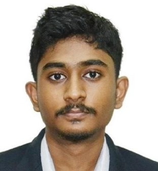

We are a team based in the [School of Computing, National University of Singapore](http://www.comp.nus.edu.sg).

You can reach us at the email `seer[at]comp.nus.edu.sg`

## Project team
### Glendon Chua

[[github](https://github.com/BigDoot)]
[[portfolio](team/bigdoot.md)]

* Role: Team Lead
* Responsibilities: Testing, Code quality

### Nicholas Nge

[[github](http://github.com/nicholasnge)]
[[portfolio](team/nicholasnge.md)]

* Role: Developer
* Responsibilities: UI, Deliverables and deadlines

### Prerthan Munireternam

[[github](http://github.com/prerthan99)] [[portfolio](team/prerthan99.md)]

* Role: Documentation
* Responsibilities: Data, Integration

### Vivegan

[[github](http://github.com/vivegank)]
[[portfolio](team/vivegank.md)]

* Role: Developer
* Responsibilities: Dev Ops + Threading, Scheduling and tracking
