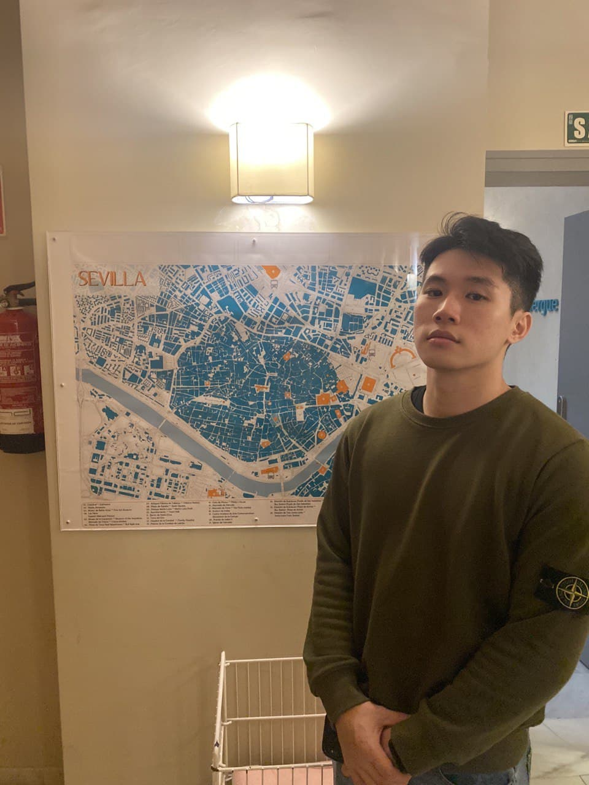

We are a team based in the [School of Computing, National University of Singapore](http://www.comp.nus.edu.sg).

You can reach us at the email `seer[at]comp.nus.edu.sg`

## Project team

### Low En Hao

[[github](https://github.com/enhao25)]
[[portfolio](team/enhao25.md)]

* Role: Deliverables and deadlines / Scheduling and tracking
* Responsibilities: Ensuring that the project is on track.

### Wong Choon Wei

[[github](http://github.com/yungweezy)]
[[portfolio](team/yungweezy.md)]

* Role: Team Lead / Integration
* Responsibilities: Responsible for overall project coordination and integration.

### Johnny Doe

[[github](http://github.com/johndoe)] [[portfolio](team/johndoe.md)]

* Role: Developer
* Responsibilities: Data

### Jean Doe

[[github](http://github.com/johndoe)]
[[portfolio](team/johndoe.md)]

* Role: Developer
* Responsibilities: Dev Ops + Threading

### James Doe

[[github](http://github.com/johndoe)]
[[portfolio](team/johndoe.md)]

* Role: Developer
* Responsibilities: UI
