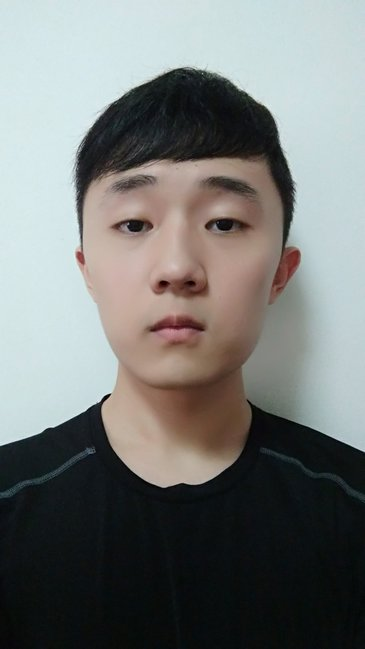
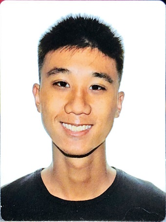
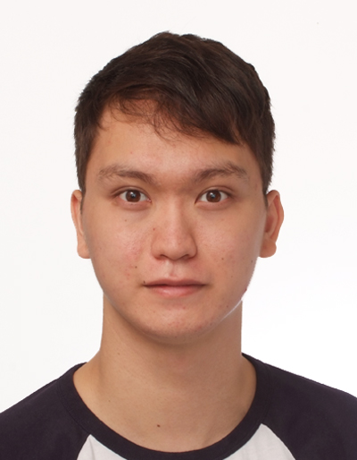
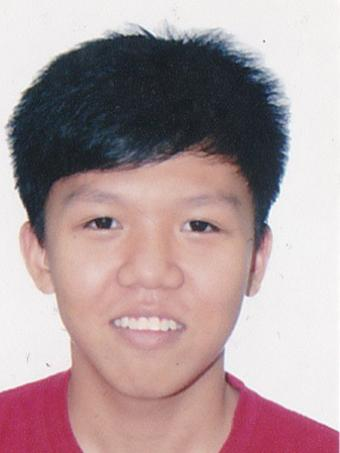
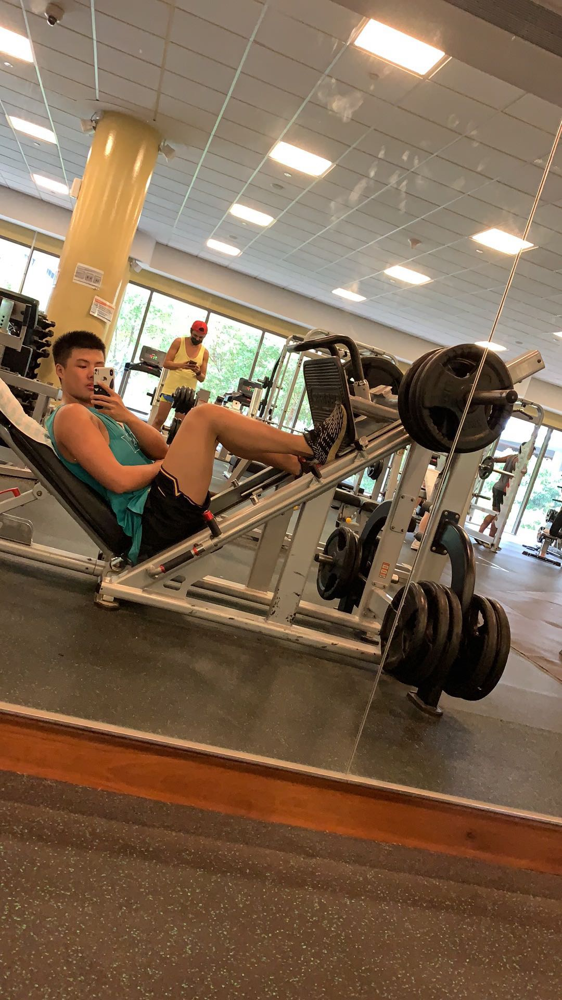

We are a team based in the [School of Computing, National University of Singapore](http://www.comp.nus.edu.sg).

## Project team

### Wang Haochen

[[github](https://github.com/ssagit)]
[[portfolio](team/ssagit.md)]

* Responsibilities: Scheduling & Tracking

### Sean Iau Yang

[[github](http://github.com/seaniy)]
[[portfolio](team/seaniy.md)]

* Responsibilities: Deliverables and deadlines

### Douglas Wei Jing Allwood

[[github](http://github.com/douglaswja)] [[portfolio](team/douglaswja.md)]

* Responsibilities: Code Quality and Integration

### Chua Jun Jie Benedict

[[github](http://github.com/benedictbcjj)]
[[portfolio](team/benedictbcjj.md)]

* Responsibilities: Testing

### Wang Yihe

[[github](http://github.com/yihe-harry)]
[[portfolio](team/yihe-harry.md)]

* Role: Developer
* Responsibilities: UI
