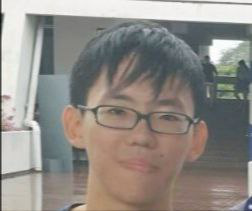
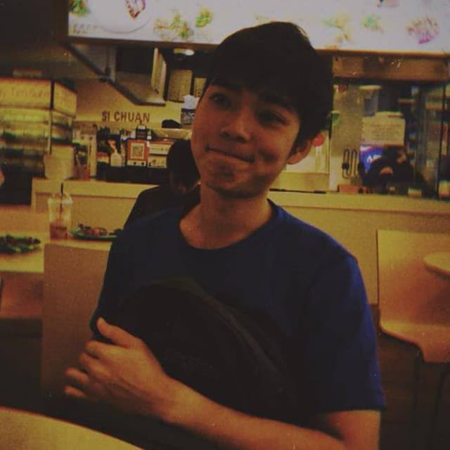
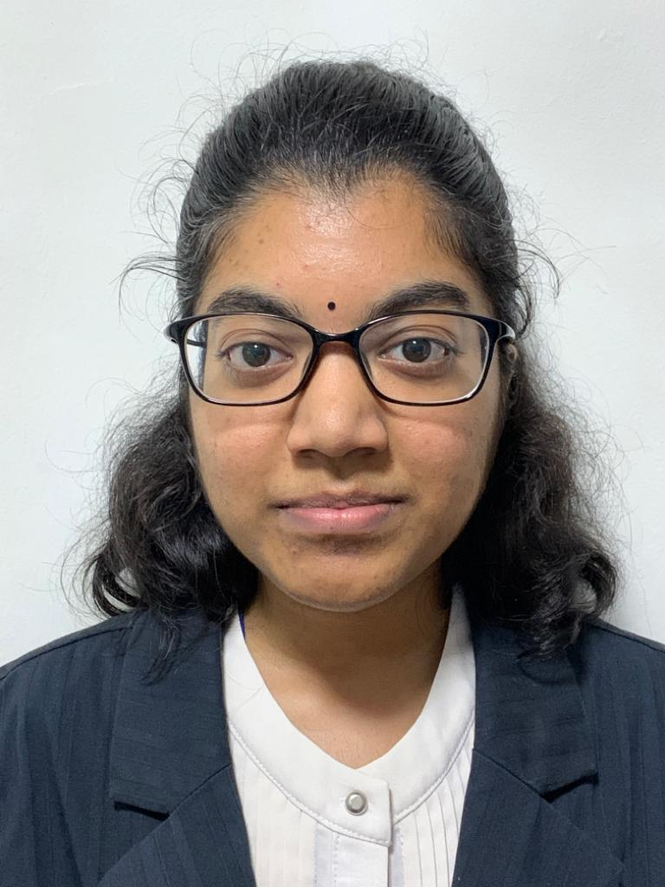
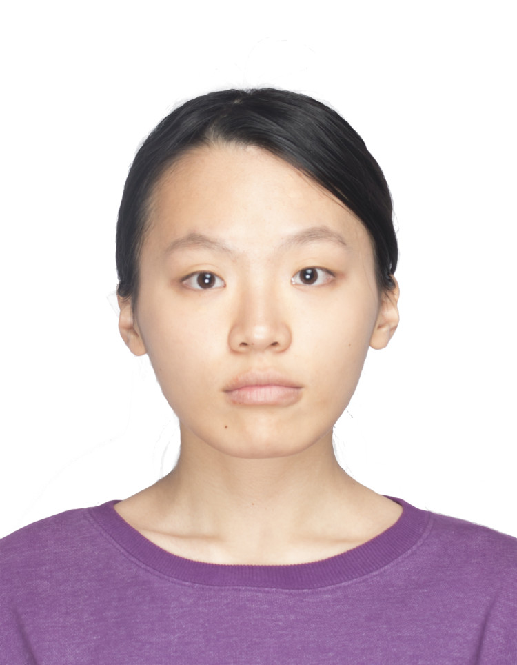

We are a team based in the [School of Computing, National University of Singapore](http://www.comp.nus.edu.sg).

You can reach us at the email `seer[at]comp.nus.edu.sg`

## Project team

### Lim Li Gang

[[github](https://github.com/whatthelump)]
[[portfolio](team/whatthelump.md)]

* Role: Developer
* Responsibilities: Deliverables and deadlines, Documentation

### Aw Zhen Yi

[[github](http://github.com/awzhenyi)]
[[portfolio](team/awzhenyi.md)]

* Role: Developer
* Responsibilities: Features, Testing

### Teng Shu Wei Jared

[[github](http://github.com/jaredtengsw)]

* Role: Developer
* Responsibilities: _TBC_

### V R Soorya

[[github](http://github.com/vrsoorya)]
[[portfolio](team/vrsoorya.md)]

* Role: Developer
* Responsibilities: Dev Ops

### Wang Tao

[[github](http://github.com/wangtao0717)]
[[portfolio](team/wangtao0717.md)]

* Role: Developer
* Responsibilities: Features, Testing
