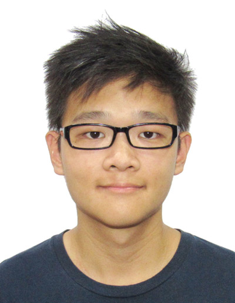

We are a team based in the [School of Computing, National University of Singapore](http://www.comp.nus.edu.sg).

You can reach us at the emails:
```
kingsley.kuan[at]u.nus.edu
vinleon[at]u.nus.edu
jared_lyj[at]u.nus.edu
e0425411[at]u.nus.edu
zou.yuting[at]u.nus.edu
```

## Project team

### Kingsley Kuan Jun Hao



[[github](https://github.com/kingsleykuan)]
[[portfolio](team/kingsleykuan.md)]

* Role: Documentation, Testing

### Koh Vinleon


[[github](http://github.com/glatiuden)]
[[portfolio](team/glatiuden.md)]

* Role: Integration

### Lim Yong Jian Jared


[[github](http://github.com/jared98lyj)]
[[portfolio](team/jared98lyj.md)]

* Role: Scheduling and tracking

### Winnie Ho Yi Xuan


[[github](http://github.com/Winniehyx)]
[[portfolio](team/winniehyx.md)]

* Role: Deliverables and deadlines

### Zou Yuting


[[github](http://github.com/yutingzou)]
[[portfolio](team/yutingzou.md)]

* Role: Code quality
