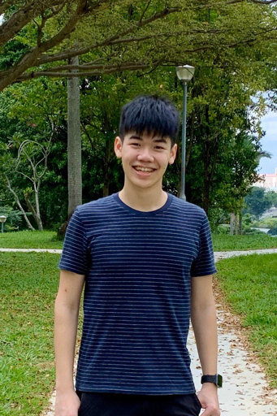
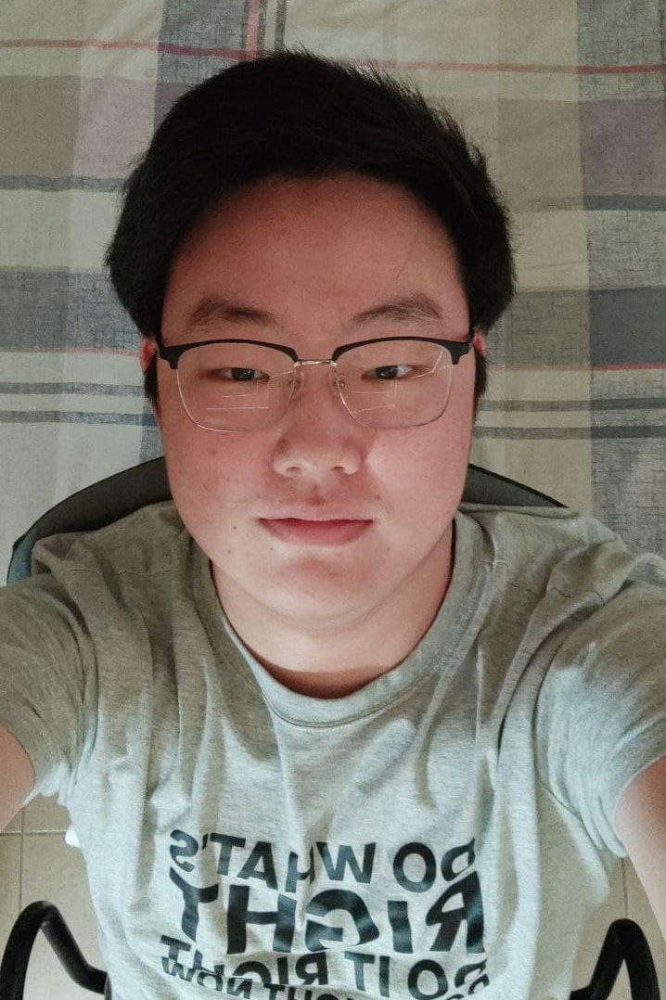

We are a team based in the [School of Computing, National University of Singapore](http://www.comp.nus.edu.sg).

You can reach us at the email `seer[at]comp.nus.edu.sg`

## CoLAB Project team

### Fang Junwei, Samuel

[[github](https://github.com/samuelfangjw)]
[[portfolio](team/samuelfangjw.md)]

* Role: Developer, in charge of Deliverables and Deadlines
* Responsibilities: UI

### Vevek Selvam

[[github](https://github.com/vevek)]
[[portfolio](team/vevek.md)]

* Role: Developer, in charge of Integration
* Responsibilities: Model, Logic

### Nguyen Duc Danh

[[github](https://github.com/Eriksen2411)]
[[portfolio](team/eriksen2411.md)]

* Role: Developer, in charge of Documentation
* Responsibilities: Storage

### Li Ruochen

[[github](https://github.com/lirc572)]
[[portfolio](team/lirc572.md)]

* Role: Developer, in charge of Code quality
* Responsibilities: Tests

