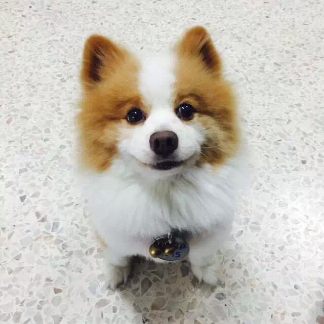
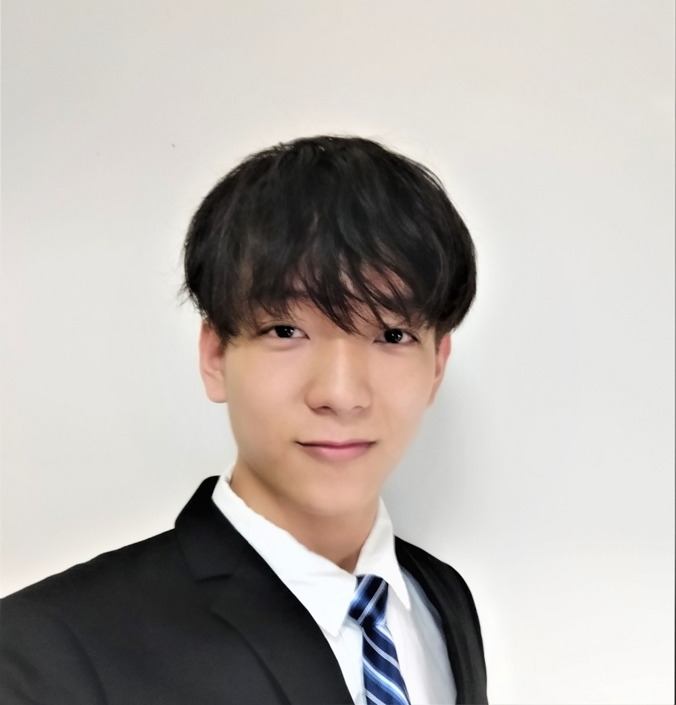
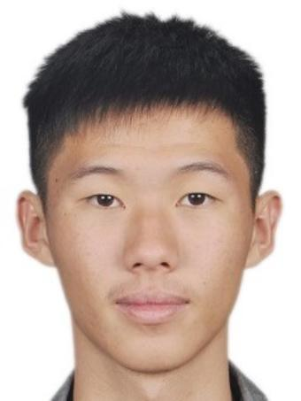
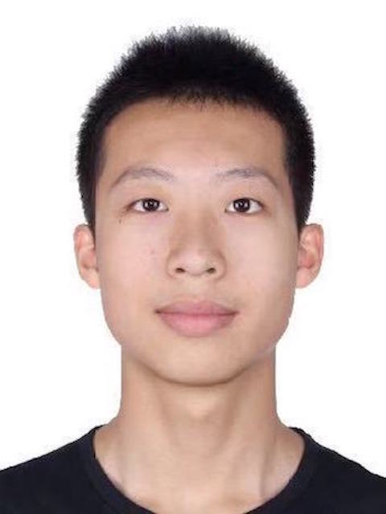

We are a team based in the [School of Computing, National University of Singapore](http://www.comp.nus.edu.sg).

You can reach us at the email `zhengyong@u.nus.edu`

## Project team

### Ang Zheng Yong

[[github](https://github.com/arsatis)]
[[portfolio](team/arsatis.md)]

* Role: Team Lead, Scheduling and Tracking
* Responsibilities:
    * Responsible for overall project coordination.
    * In charge of defining, assigning, and tracking project tasks.

### Guo Yichao

[[github](http://github.com/gycc7253)]
[[portfolio](team/gycc7253.md)]

* Role: Documentation
* Responsibilities:
    * Responsible for the quality of various project documents.
    * Responsible for distributing of Documentation related jobs.

### Huang Nanxi

[[github](http://github.com/nanxi-huang)]
[[portfolio](team/nanxi-huang.md)]

* Role: Code quality, Deliverables and Deadlines
* Responsibilities:
    * Looks after code quality, ensures adherence to coding standards, etc.
    * Ensure project deliverables are done on time and in the right format.

### Loh Guo Jun

[[github](http://github.com/gj0407790)]
[[portfolio](team/gj0407790.md)]

* Role: Testing
* Responsibilities:
    * Ensures the testing of the project is done properly and on time.
    * Ensures the number of test case is sufficient.

### Zhang Guangzesheng

[[github](https://github.com/Andrewzhang217)]
[[portfolio](team/Andrewzhang217.md)]

* Role: Integration, UI
* Responsibilities:
    * In charge of versioning of the code, maintaining the code repository, integrating various parts of the software to create a whole.
    * In charge of ensuring the GUI is up to standard.
