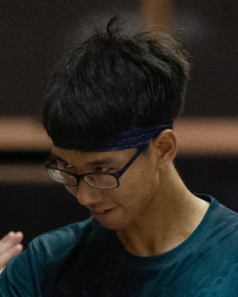
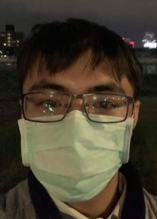
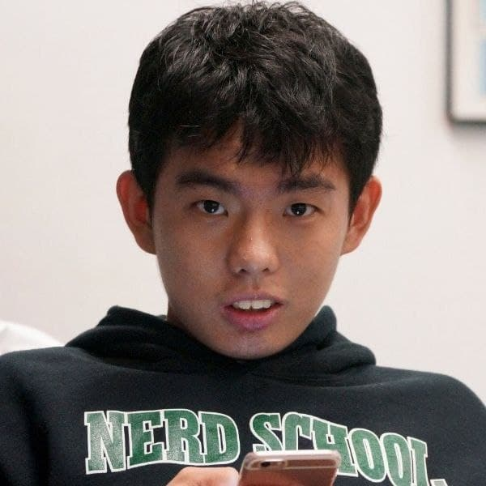
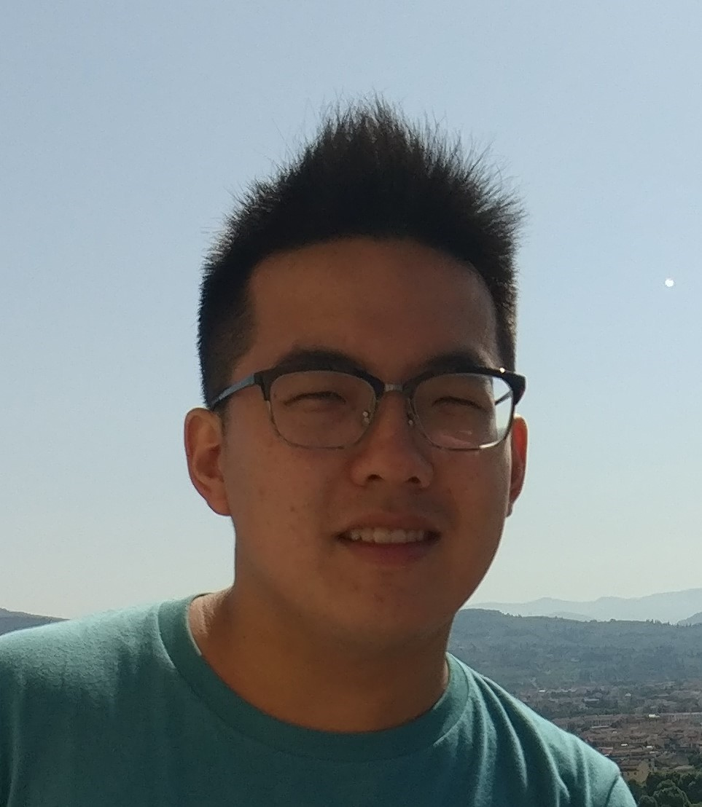

We are a team based in the [School of Computing, National University of Singapore](http://www.comp.nus.edu.sg).

## Project team

### Kenny Chew Pu Yang

[[github](http://github.com/KnitidCeladon23)]
[[portfolio](team/kennychew.md)]

* Role: Developer
* Responsibilities: Testing

### Huang, Po-Wei

[[github](http://github.com/georgepwhuang)]
[[portfolio](team/georgepwhuang.md)]

* Role: Developer
* Responsibilities: Deliverables, IntelliJ, UI

### Koh Huai Ze

[[github](http://github.com/HuaiZe)]
[[portfolio](team/huaize.md)]

* Role: Developer
* Responsibilities: Documentation, Code Quality

### Liu Shuyang

[[github](http://github.com/Shuyang0)]
[[portfolio](team/shuyang.md)]

* Role: Developer
* Responsibilities: Integration, Git expert
