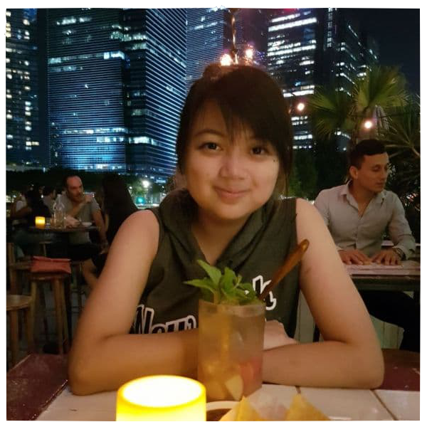
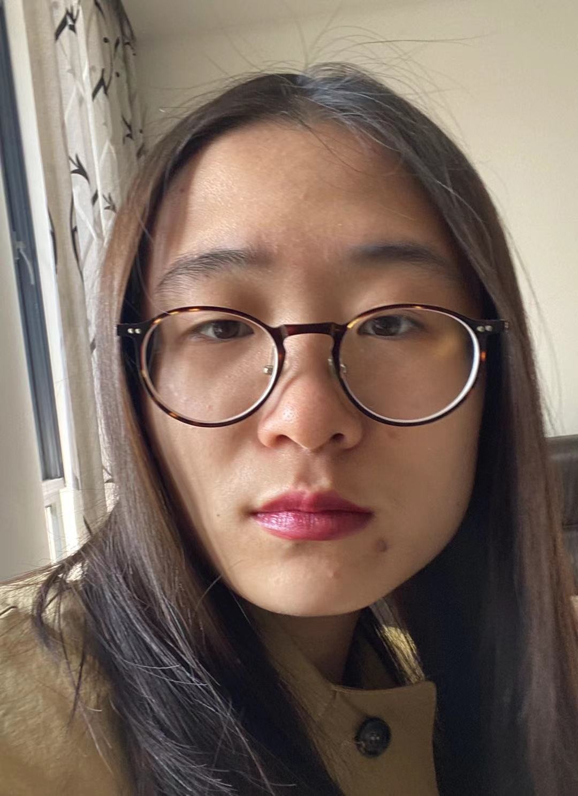
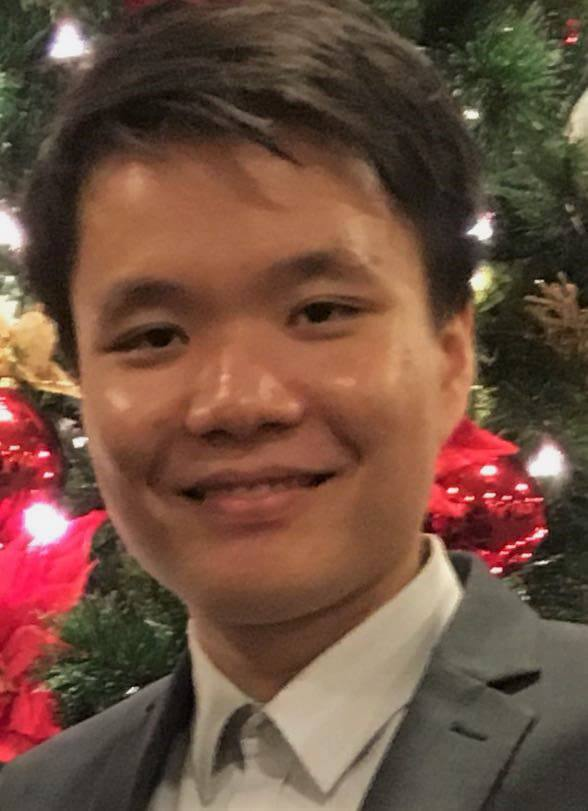
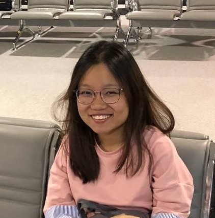

We are a team based in the [School of Computing, National University of Singapore](http://www.comp.nus.edu.sg).

## TutorsPet Project team

### Andrea Tan Wan Ling

[[github](http://github.com/andrea-twl)]

* Role: Documentation, Testing
* Responsibilities: Ensures quality of various project documents

### Gu Yichen

[[github](http://github.com/chenzaza)]

* Role: Code quality, Testing
* Responsibilities: Ensures adherence to coding standards

### Han Zong Yu

[[github](https://github.com/internityz)]

* Role: Integration, Testing
* Responsibilities: Versioning of code, maintaining the code repository, integrating various parts of the software to create a whole.

### Kang Min Hui, Mabel

[[github](http://github.com/mabel-kang)]

[[Project Portfolio Page](team/mabel-kang.md)]

* Role: Scheduling and tracking, Testing
* Responsibilities:  Defining, assigning, and tracking project tasks

### Sylvia Ong Kai Ting

[[github](http://github.com/sylviaokt)]

* Role: Deliverables and deadlines, Testing
* Responsibilities: Ensure project deliverables are done on time and in the right format
