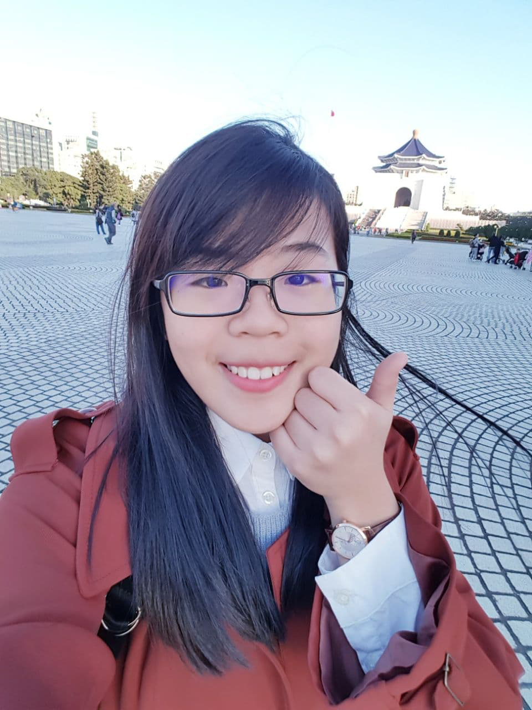

We are a team based in the [School of Computing, National University of Singapore](http://www.comp.nus.edu.sg).

You can reach us at the email `seer[at]comp.nus.edu.sg`

## Project team

### Alzahrani Riyadh Hamdan S

[[github](https://github.com/riyadh-h)]
[[portfolio](team/riyadh-h.md)]

* Role: Member
* Responsibilities: Development, testing, and documentation of `Contact`-related features; meetings timekeeping.

### Dick Jessen William

[[github](http://github.com/jessen11)]
[[portfolio](team/jessen11.md)]

* Role: Member
* Responsibilities: Implementation and Documentation of Note Feature.

### Otto Alexander Sutianto

[[github](http://github.com/godjuansan)]
[[portfolio](team/godjuansan.md)]

* Role: Member
* Responsibilities: Implementation and Documentation of Note Feature.

### Teo Hoe Keat

[[github](http://github.com/teohoekeat)]
[[portfolio](team/teohoekeat.md)]

* Role: Member
* Responsibilities: Implementation and Documentation of UI & Help Feature, Weekly Meeting Documentation.  

### Tian Xindi

[[github](http://github.com/XindiTian)]
[[portfolio](team/johndoe.md)]

* Role: Member
* Responsibilities: Implementation and Documentation of Dictionary and Definitions' Model and Features.
