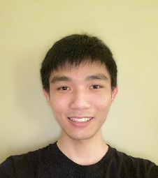

We are a team based in the [School of Computing, National University of Singapore](http://www.comp.nus.edu.sg).

You can reach us at the respective emails:
* Wong Khia Xeng `e0407883@u.nus.edu`
* Heng Yong Ming `e0425848@u.nus.edu`
* Joven Pua Zai Xiong`e0415502@u.nus.edu`
* Noel Mathew Issac `e0415881@u.nus.edu`

## Project Team

### Wong Khia Xeng

[Github](https://github.com/khiaxeng)
[[portfolio](team/khiaxeng.md)]

* Role: Team Lead
* Responsibilities: Quality Assurance

### Heng Yong Ming

[Github](https://github.com/hengyongming)
[[portfolio](team/hengyongming.md)]

* Role: Developer
* Responsibilities: Backend expert

### Noel Mathew Issac

[Github](https://github.com/noelmathewisaac)
[[portfolio](team/noelmathewisaac.md)]

* Role: Developer
* Responsibilities: UI expert

### Joven Pua Zai Xiong

[Github](https://github.com/CSmortal)
[[portfolio](team/csmortal.md)]

* Role: Developer
* Responsibilities: Testing expert

