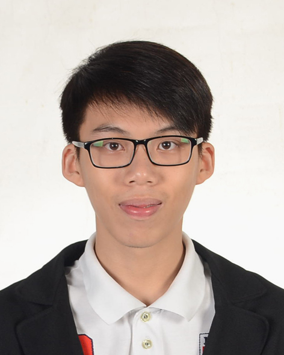
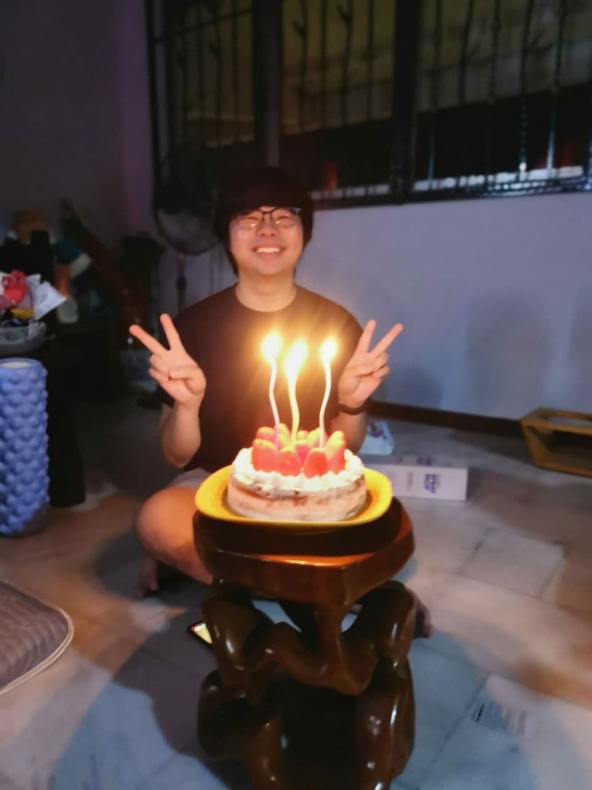

We are a team based in the [School of Computing, National University of Singapore](http://www.comp.nus.edu.sg).

## Project team

### Aaron Saw Min Sern

[[github](https://github.com/aaronsms)]
[[portfolio](team/aaronsms.md)]

* Role: Developer
* Responsibilities: Software Testing

### Daniel Lau Yew En

[[github](http://github.com/daniellau88)]
[[portfolio](team/daniellau88.md)]

* Role: Developer
* Responsibilities: DevOps (CI)

### Lauren Lee Hui Ying

[[github](http://github.com/laurenlhy)]
[[portfolio](team/laurenlhy.md)]

* Role: Developer
* Responsibilities: Documentation

### Lim Li Quan

[[github](http://github.com/ahquanz)]
[[portfolio](team/ahquanz.md)]

* Role: Developer
* Responsibilities: Software Testing

### Ng Wei Xue

[[github](http://github.com/weixue123)]
[[portfolio](team/weixue123.md)]

* Role: Developer
* Responsibilities: UI Designer
