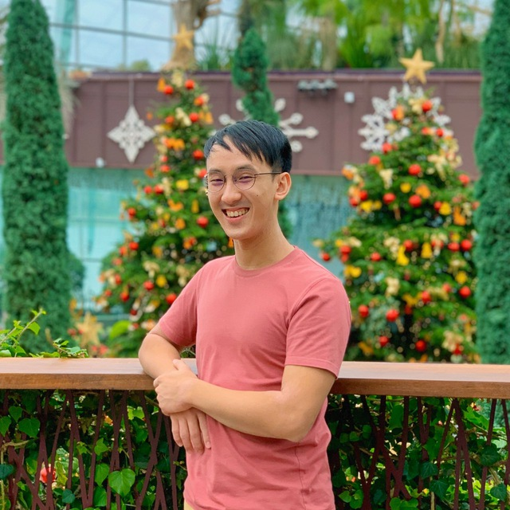

#About Us

We are a team based in the [School of Computing, National University of Singapore](http://www.comp.nus.edu.sg).

You can reach us at the email at our individual emails below!

## Project team

### Kelvin

[Github](https://github.com/zoeykobe)  
[portfolio](team/kelvin.md)

* Role: Team Leader

### Friscilia

[github](https://github.com/frisciliasultan)  
[[portfolio](team/friscilia.md)]

* Role: Developer
* Responsibilities: Testing

### Isaiah

[github](https://github.com/Zaiah0505)  
[portfolio](team/isaiah.md)

* Role: Developer
* Responsibilities: Scheduling and Tracking, UI

### Jody

[github](https://github.com/JodyLorah)  
[portfolio](team/jodylorah.md)

* Role: Developer
* Responsibilities: Code Quality

### Qin Liang

[github](http://github.com/Tomashiwa)  
[portfolio](team/qinliang.md)

* Role: Developer
* Responsibilities: Integration

### Shaun

[github](http://github.com/Juzzanoob)  
[portfolio](team/shaun.md)

* Role: Developer
* Responsibilities: Documentation
