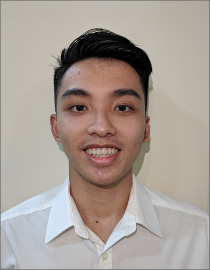

We are a team based in the [School of Computing, National University of Singapore](http://www.comp.nus.edu.sg).

You can reach us at the email `seer[at]comp.nus.edu.sg`
## Mentors
* Lecturer : Prof Damith Chatura Rajapakse
* Supervisor : Choo Qi Le Aaron

## Project team

### Oh Jun Ming

[[github](https://github.com/OhJunMing)]
[[portfolio](team/ohjunming.md)]

* Role: Deciding, we will allocate

### Shi Zheng

[[github](http://github.com/ShiZheng001)]
[[portfolio](team/shizheng001.md)]

* Role: Not yet decided

### Rajarshi Basu

[[github](http://github.com/rajobasu)]
[[portfolio](team/rajobasu.md)]

* Role: NOT Specific

### Ho Wei Jun Sherman

[[GitHub](https://github.com/nighoggDatatype)]
[[portfolio](team/nighoggdatatype.md)]

* Role: Developer
* Languages: C, Java, C#, Typescript, Ruby
