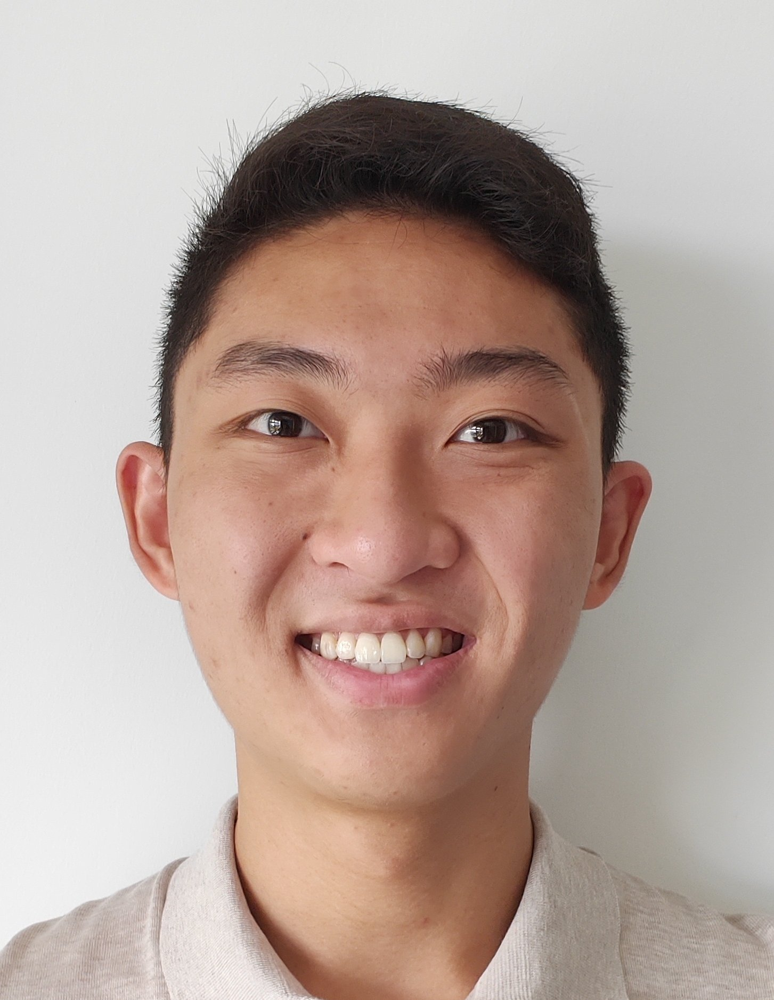

We are a team based in the [School of Computing, National University of Singapore](http://www.comp.nus.edu.sg).

## StoreMando Project Team

### Chen Yan Jia Jay

[[github](https://github.com/JayChenYJ)]
[[portfolio](team/jaychenyj.md)]
You can reach me at the email `e0406389@u.nus.edu`

* Role: Team Lead
* Responsibilities: Scheduling and tracking, Deliverables and deadlines
  
### Chew Wei Hao

[[github](http://github.com/chewwh09)]
[[portfolio](team/chewwh09.md)]
You can reach me at the email `e0417962@u.nus.edu`

* Role: Developer
* Responsibilities: Logic and GUI Expert

### Mohamed Fazil

[[github](http://github.com/Md-Fazil)] [[portfolio](team/md-fazil.md)] You can reach me at the email `mohamedfazil@u.nus.edu`

* Role: Developer
* Responsibilities: Documentation and Git Expert

### Kumaran S/O Selvvaratnam

[[github](http://github.com/kumsssss)]
[[portfolio](team/kumsssss.md)]
You can reach me at the email `e0407113@u.nus.edu`

* Role: Developer
* Responsibilities: Documentation and Testing Expert

### Amanda Ang Yee Min

[[github](http://github.com/github-amanda)]
[[portfolio](team/github-amanda.md)]
You can reach me at the email `amandaang@u.nus.edu`

* Roles: Developer
* Responsibilities: GUI and SourceTree Expert
