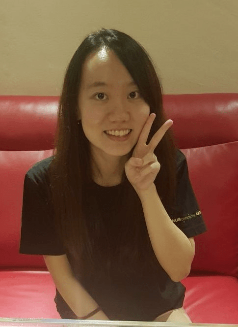

We are a team based in the [School of Computing, National University of Singapore](http://www.comp.nus.edu.sg).

## Project team

### Glenn Lee

[[github](http://github.com/glennljs)]

### Justin Peh Yu Xiang

[[homepage](https://pyuxiang.com/)]
[[github](https://github.com/pyuxiang)]
[[portfolio](team/pyuxiang.md)]

### Foo Chuan Le, Nicholas

[[github](http://github.com/nickyfoo)]
[[portfolio](team/nickyfoo.md)]

### Gary Lee Jia Jin

[[github](https://github.com/garyljj)]

### Zheng Ruoxin

[[github](https://github.com/zhengruoxin)]
[[portfolio](team/zhengruoxin.md)]

### Lee Pai Joo Yvelle

[[github](https://github.com/ellevy)]
[[portfolio](team/ellevy.md)]
