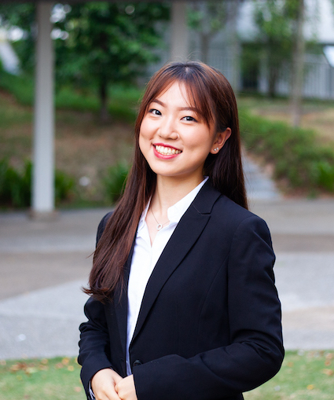
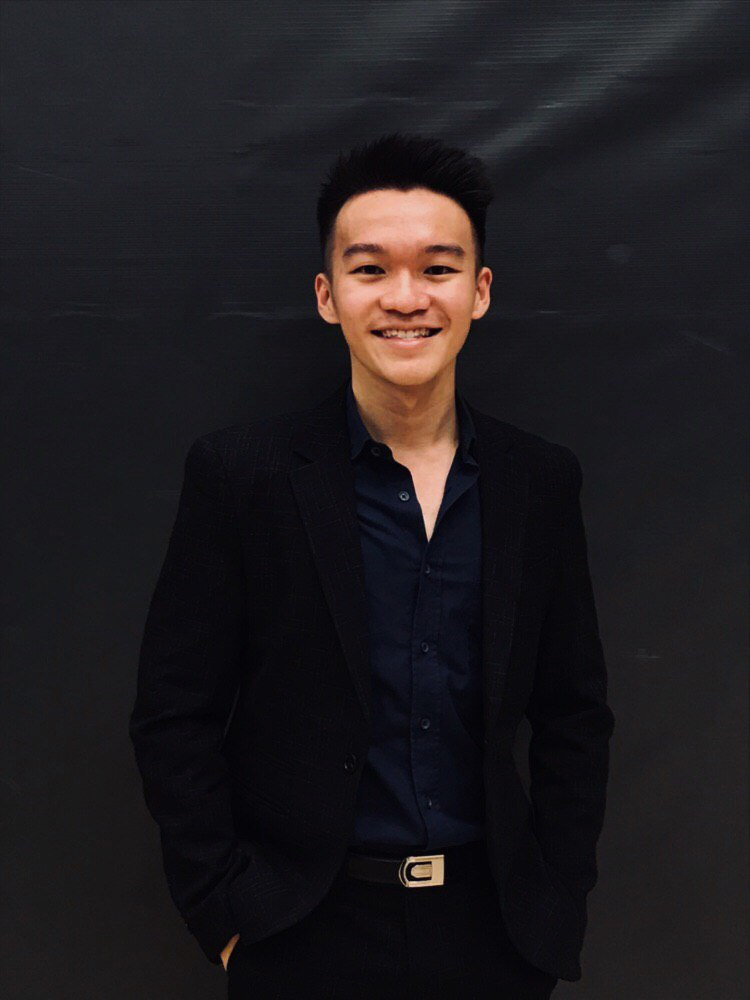
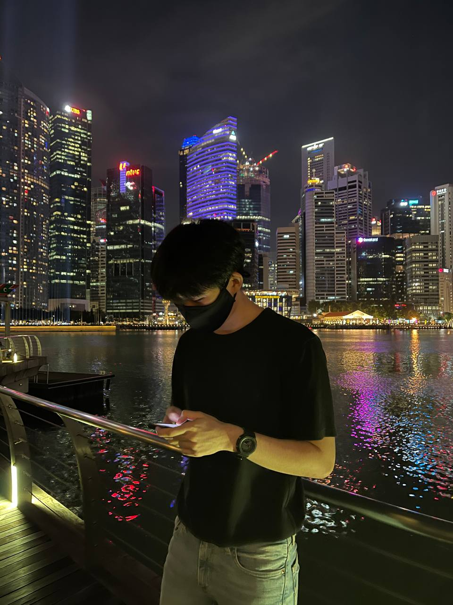

  
  <h1 align="center" style="margin-top:15px;">BudgetBaby :baby: :money_with_wings: Team</h1>

 

We are a team based in the [School of Computing, National University of Singapore](http://www.comp.nus.edu.sg).

You can reach us at the email `seer@comp.nus.edu.sg`

## Project team

### He Xinyue

[[github](https://github.com/eksinyue)]
[[portfolio](team/eksinyue.md)]

- Role: Team Lead
- Responsibilities: To be updated

### Jaryl Loh

[[github](http://github.com/jxrrelo)]
[[portfolio](team/jxrrelo.md)]

- Role: Developer
- Responsibilities: UI

### Lai Yu Heem

[[github](http://github.com/yuheem)] [[portfolio](team/yuheem.md)]

- Role: Developer
- Responsibilities: Integration + Model Component

### Ong Siying Natasha

[[github](http://github.com/natosy)]
[[portfolio](team/natosy.md)]

- Role: Developer
- Responsibilities: Dev Ops + Threading

### Tan De Yi

[[github](http://github.com/deyixtan)]
[[portfolio](team/deyixtan.md)]

- Role: Developer
- Responsibilities: UI
