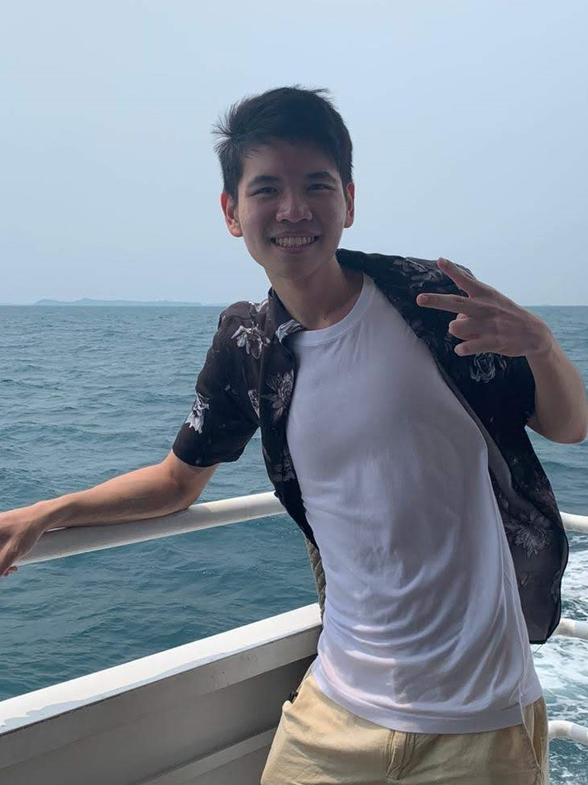

  

<h1 class="post-title">{{ page.title | escape }}</h1>
<h3 class="post-subtitle">Project Team</h3>

 

ImPoster developer team is based in the [School of Computing, National University of Singapore](http://www.comp.nus.edu.sg). You can reach us at the email `imposterdevteam@gmail.com`

## Project team

### Juliet Teoh

  
  

	

* Role: Developer
* Responsibilities: Update existing AB3 commands and documentation

### Liu Yongliang

  
  

	

* Role: Developer
* Responsibilities: Update new features and ensure code quality

### Ong Jun Xiong

  
  

	

* Role: Developer
* Responsibilities: Update existing AB3 commands and documentation

### Tan Jin

  
  
  

	

* Role: Developer
* Responsibilities: Update new features and ensure smooth integrations

### Warren Ng

  
  

	

* Role: Developer
* Responsibilities: Update user interface and provide quality assurance
