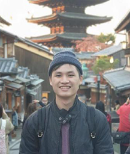

We are a team based in the [School of Computing, National University of Singapore](http://www.comp.nus.edu.sg).

You can reach us at the email `jjimy@comp.nus.edu.sg`

## Project team

### Ian Chan Kit Wai

[[github](http://github.com/IanCKW)]
[[portfolio](team/ian.md)]

* Role: Team Lead
* In Charge of: Food Orders

### James Lee Hong Thern

[[github](https://github.com/jamesleeht)]
[[portfolio](team/james.md)]

* Role: Testing
* In Charge of: Food Inventory

### Guan Yang Ze

[[github](http://github.com/guanyz)]
[[portfolio](team/yangze.md)]

* Role: Documentation
* In Charge of: Shopping List

### Lee Kang Ting Marcus

[[github](http://github.com/kangtinglee)]
[[portfolio](team/marcus.md)]

* Role: Integration
* In Charge of: Contact

### Kong Jian Wei

[[github](http://github.com/Sharptail)]
[[portfolio](team/jianwei.md)]

* Role: Code Quality
* In Charge of: Menu
