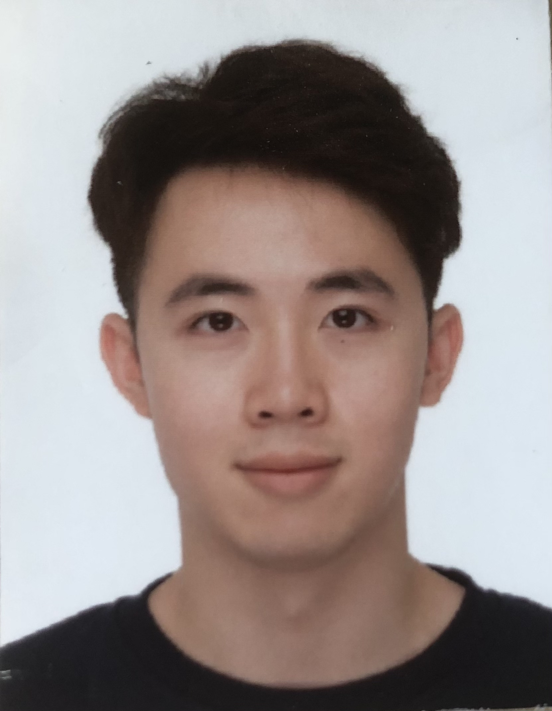

We are a team based in the [School of Computing, National University of Singapore](http://www.comp.nus.edu.sg).

You can reach us at the email `seer[at]comp.nus.edu.sg`

## Project team

### Michael Ong

[[github](https://github.com/maikongeh)]
[[portfolio](team/maikongeh.md)]

* Role: Developer
* Responsibility: Testing

### Huang Zhenxin

[[github](http://github.com/Hzxin)]
[[portfolio](team/hzxin.md)]

* Role: Integration
* Responsibilities: UI

### Jeremias Shae

[[github](http://github.com/jellymias)]
[[portfolio](team/jellymias.md)]
* Role: Developer
* Responsibilities: Documentation, Testing

### Chiang Kee Woon Jonathan

[[github](http://github.com/banchiang)]
[[portfolio](team/banchiang.md)]

* Role: Developer
* Responsibilities: Code Quality checking

### Marcus Ong

[[github](http://github.com/markuz5116)]
[[portfolio](team/markuz5116.md)]

* Role: Team Lead
* Responsibilities: Deliverables and Deadlines
